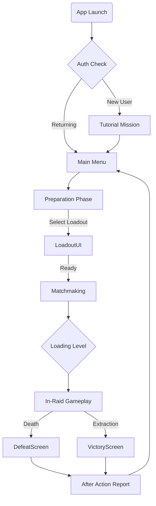

# UX Flows & Wireframes

**[← Back to Index](../README.md)** | **[Visual Style →](./Visual_Style.md)**

---

## 🧭 User Journey Map

### Session Flow (The "Happy Path")



---

## 📱 Key Screen Wireframes

### 1. Main Menu (Hub)

**Goal:** Quick access to "Play" while showing progression.

```
+--------------------------------------------------+
| [Profile Lvl 12]                   [Currency $$] |
|                                                  |
|      [ 3D OPERATOR MODEL - CENTER STAGE ]        |
|                                                  |
|                   [ PLAY ]                       |
|             (Pulsing Action Button)              |
|                                                  |
| [LOADOUT]      [TRADERS]      [HIDEOUT]    [XXX] |
|                                                  |
| [Battle Pass]                        [Social/Friends] |
+--------------------------------------------------+
```
*   **Primary Action:** `[PLAY]` must be the largest element.
*   **Secondary:** `Loadout` and `Traders` are most frequent.
*   **Tertiary:** `Hideout` and `Social` can be smaller icons.

### 2. Inventory Management (The "Tetris")

**Goal:** Efficient sorting and equipping.

```
+--------------------------------------------------+
| < Back          STASH (10x30)           [Sort ▼] |
|--------------------------------------------------|
| [  ][  ][  ][  ][  ][  ]  |  [EQUIPPED SLOT]     |
| [  ][Rifle ][  ][  ][  ]  |  +----------------+  |
| [  ][      ][  ][  ][  ]  |  |   PRIMARY      |  |
| [  ][  ][  ][  ][  ][  ]  |  |    [AK-47]     |  |
| [  ][Medkit][  ][  ][  ]  |  +----------------+  |
|                           |  [HELMET] [ARMOR]    |
| [DRAG ITEM HERE TO EQUIP] |  [RIG]    [BACKPACK] |
+--------------------------------------------------+
```
*   **Interaction:** Drag & Drop is primary. Double-tap to quick equip.
*   **Feedback:** Valid slots highlight Green. Invalid slots (wrong type) highlight Red.

### 3. Looting Interface (In-Game)

**Goal:** Speed vs. Risk. Looting blocks visibility.

```
+--------------------------------------------------+
| (Blurred Game Background)        [X] CLOSE       |
|                                                  |
| CONTAINER: Dead Scav         YOUR INVENTORY      |
| +-------------------+       +-------------------+|
| | [Pistol] [Ammo]   |   >>  | [Rifle  ] [Med]   ||
| | [Key   ] [    ]   |       | [       ] [   ]   ||
| +-------------------+       +-------------------+|
|                                                  |
| [LOOT ALL] (Hold)           Weight: 24.5kg       |
+--------------------------------------------------+
```
*   **Tension Element:** The UI covers 70% of the screen. The player is blind to movement while looting.
*   **Quick Action:** "Loot All" button has a 1-second hold timer to prevent accidental clicks and simulate "gathering" time.

---

## 🔄 Interaction States

### Button States
1.  **Normal:** Default color/opacity.
2.  **Pressed:** 90% scale + Haptic feedback.
3.  **Disabled:** 50% opacity, Grayscale.
4.  **Selected:** Highlight border + Glow.

### Feedback Loop
*   **Positive Action:** Green flash or Gold outline (e.g., Successfully equipping an item).
*   **Negative Action:** Red shake animation (e.g., Trying to equip a Primary weapon in a Secondary slot).
*   **Process:** Spinner/Progress bar for long actions (e.g., Searching a body).

---
