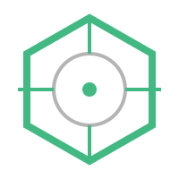

<pre>
███████╗██╗  ██╗████████╗██████╗  █████╗  ██████╗████████╗██╗ ██████╗ ███╗   ██╗
██╔════╝╚██╗██╔╝╚══██╔══╝██╔══██╗██╔══██╗██╔════╝╚══██╔══╝██║██╔═══██╗████╗  ██║
█████╗   ╚███╔╝    ██║   ██████╔╝███████║██║        ██║   ██║██║   ██║██╔██╗ ██║
██╔══╝   ██╔██╗    ██║   ██╔══██╗██╔══██║██║        ██║   ██║██║   ██║██║╚██╗██║
███████╗██╔╝ ██╗   ██║   ██║  ██║██║  ██║╚██████╗   ██║   ██║╚██████╔╝██║ ╚████║
╚══════╝╚═╝  ╚═╝   ╚═╝   ╚═╝  ╚═╝╚═╝  ╚═╝ ╚═════╝   ╚═╝   ╚═╝ ╚═════╝ ╚═╝  ╚═══╝
                      [ MASTER DOCUMENTATION PORTAL ]
</pre>

# Extraction Shooter - Game Design Document (GDD)

  

This is the central repository and gateway for all documentation related to the Extraction Shooter project. It serves as the single source of truth for both the creative vision and the technical implementation of our top-down, high-stakes tactical experience.

---

## Project Snapshot

| Category               | Details                                   |
| :--------------------- | :---------------------------------------- |
| **Engine**             | Unreal Engine 5 (C++)                     |
| **Primary Platform**   | Mobile (iOS / Android)-Controller Support |
| **Secondary Platform** | Windows PC (Controller Support)           |
| **Genre**              | Top-down Extraction Shooter, Multiplayer  |
| **Current Phase**      | Pre-Production / Core Prototyping         |

---

## Project Portals

Access the specialized documentation hubs based on your role and current task.

### Design & Creative Hub
Focused on player experience, world-building, and visual/audio aesthetics.
*   **[GDD Design Overview](./GDD_Design/README.md)** — Entry point for all design docs.
*   **[World & Level Design](./GDD_Design/World/MapDesign.md)** — Maps, POIs, and environmental storytelling.
*   **[Art & Visuals](./GDD_Design/Visuals/ArtDirection.md)** — Style guides, asset specs, and UI/UX.
*   **[Core Gameplay Design](./GDD_Design/GameDesign/CoreGameplay.md)** — Loops, mechanics, and player journey.
*   **[Audio Vision](./GDD_Design/Audio/SoundDesign.md)** — Tactical audio and immersive soundscapes.

### Technical & Engineering Hub
Focused on implementation, systems architecture, and technical workflows.
*   **[GDD Technical Overview](./GDD_Technical/README.md)** — Entry point for all technical docs.
*   **[System Architecture](./GDD_Technical/Core/Architecture.md)** — Module structure and tech stack.
*   **[Gameplay Systems](./GDD_Technical/Gameplay/CharacterSystem.md)** — Character, Weapon, and Inventory logic.
*   **[Networking & Social](./GDD_Technical/Core/NetworkingSystem.md)** — Server-client model and multiplayer sync.
*   **[AI & Systems](./GDD_Technical/Systems/AISystem.md)** — NPC behavior and world logic.

---

## Role Guidance

### For Design & Art Teams
*   **Single Source of Truth**: Always refer to the [Design Hub](./GDD_Design/README.md) before starting any creative work.
*   **Visual Consistency**: Follow the [Style Guide](./GDD_Design/Visuals/StyleGuide.md) strictly to ensure cross-platform visual fidelity.
*   **Feedback Loop**: When updating mechanics, ensure the [Core Loop](./GDD_Design/GameDesign/CoreGameplay.md) is adjusted to reflect the change.
*   **Asset Submission**: Use the technical specs in [Asset Guidelines](./GDD_Design/Visuals/AssetGuidelines.md) to prepare models for UE5.

### For Technical & Dev Teams
*   **Implementation Specs**: All Enums, Codenames, and Interface contracts are defined in the [Technical Hub](./GDD_Technical/README.md).
*   **Performance First**: Adhere to the budgets defined in the [Performance & Optimization](./GDD_Technical/Performance/Optimization.md) section.
*   **Task Management**: Follow the [Development Roadmap](./GDD_Technical/Core/DevelopmentRoadmap.md) for milestone priorities.
*   **Code Standards**: Maintain modularity as outlined in the [Architecture](./GDD_Technical/Core/Architecture.md) documentation.

---

## Core Planning & Progress

### Project Scope
*   **[MVP Definition](./GDD_Design/ProjectScope/MVP.md)** — Minimum Viable Product features.
*   **[Non-Goals](./GDD_Design/ProjectScope/NonGoals.md)** — Features explicitly out of current scope.
*   **[Risk Assessment](./GDD_Design/ProjectScope/Risks.md)** — Known challenges and mitigation strategies.

### Recent Milestones
*   **Audio Architecture**: Completed `Soundscape` and `Tactical Audio` definitions.
*   **Visual Direction**: Finalized `Art Bible` and `Mobile Performance Budgets`.
*   **Map System**: Expanded `Industrial Zone` hotspots and loot heatmaps.

---

## Quick Start
1.  **Read the [MVP Scope](./GDD_Design/ProjectScope/MVP.md)** to understand the current focus.
2.  **Explore the [Core Loop](./GDD_Design/GameDesign/CoreGameplay.md)** to grasp the game's heartbeat.
3.  **Review the [Technical Roadmap](./GDD_Technical/Core/DevelopmentRoadmap.md)** if you are contributing code.

---
*Last Updated: February 9, 2026*  
*Lead Designer: [Name] | Technical Lead: [Name]*

