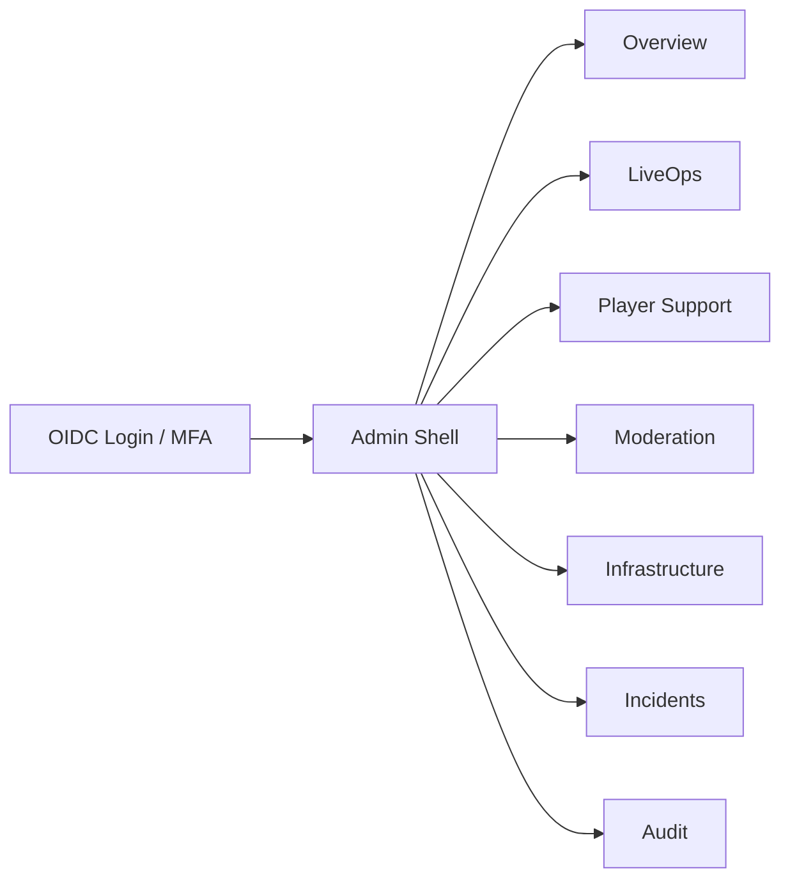
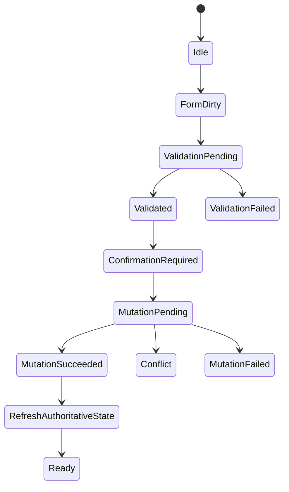

# LiveOps Admin UI Page Specification

## 1. Scope

This document defines the future Admin Web information architecture, routes, API usage, permissions, layouts, states, dangerous actions, audit behavior, and acceptance criteria. It is a design/contract artifact only.

- Proposed future stack: Next.js + TypeScript.
- The UI calls Admin APIs only; it never accesses PostgreSQL, Redis, object storage, or Dedicated Server processes directly.
- English is canonical. This file is UTF-8.
- All displayed timestamps are UTC; local time may be secondary and must be labeled.
- Backend authorization is authoritative; UI permission gates only improve navigation and usability.

## 2. Application Shell



```text
+---------------------------------------------------------------------+
| ENVIRONMENT: STAGE | Search | Incident Alert | Admin User | Logout  |
+-----------------+---------------------------------------------------+
| Sidebar         | Breadcrumbs                                       |
|                 +---------------------------------------------------+
| Overview        | Page title / permission-aware actions             |
| LiveOps         |                                                   |
| Players         | Main content                                      |
| Moderation      |                                                   |
| Infrastructure  |                                                   |
| Incidents       |                                                   |
| Audit           |                                                   |
+---------------+-----------------------------------------------------+
```

## 3. Global UI Contract

Every page specification must define:

- route and purpose;
- API calls and authoritative refresh calls;
- required permission and environment scope;
- primary/secondary actions;
- fields, filters, sorting, and pagination;
- loading, ready, empty, stale, error, forbidden, not-found, conflict, and retry states;
- dangerous action and confirmation requirements;
- audit metadata;
- success and failure behavior.

### 3.1 Shared state labels

```text
Loading | Ready | Empty | Stale | Refreshing | Error | Forbidden | NotFound
Conflict | ValidationFailed | MutationPending | MutationSucceeded | MutationFailed
```

### 3.2 Mutation flow



Every successful mutation refetches the authoritative resource and related audit event. The UI must not treat an accepted command as completed until command status confirms it.

### 3.3 Danger levels

```text
low       -> normal confirmation
medium    -> reason required
high      -> reason + explicit CONFIRM
critical  -> reason + approval + explicit CONFIRM + incident reference
```

| Action | Level |
|---|---|
| Edit draft | low |
| Archive config | medium |
| Revoke sessions | medium |
| Publish Production | high/critical |
| Rollback Production | critical |
| Grant premium currency | high |
| Ban/unban | high |
| Disable queue | high |

## 4. Page Contract Matrix

| Page | Route | API | Permission | Main danger |
|---|---|---|---|---|
| Admin login/session | `/admin/login` | OIDC, `/v1/admin/me` | authenticated admin | logout/revoke |
| Overview dashboard | `/admin` | dashboard, servers, queues, incidents | dashboard/server/queue/incident read | none |
| LiveOps config list | `/admin/liveops` | configs list | `config.read` | archive/publish/rollback |
| Config editor | `/admin/liveops/new`, `/admin/liveops/:id` | config CRUD/validate | config create/write/validate | edit Production draft |
| Validation result | `/admin/liveops/:id/validation` | validate | `config.validate` | blocks review/publish |
| Diff viewer | `/admin/liveops/:id/diff` | diff/history | `config.read` | links to publish/rollback |
| Review/approval | `/admin/liveops/:id/review` | submit/approve | submit/approve | approve/reject |
| Publish confirmation | `/admin/liveops/:id/publish` | publish | `config.publish` | Production activation |
| Rollback confirmation | `/admin/liveops/:id/rollback` | rollback/history | `config.rollback` | Production rollback |
| Player search | `/admin/players` | players list | `player.read` | none |
| Player detail | `/admin/players/:id` | player/matches/sanctions | player/match/sanction read | revoke sessions |
| Inventory/wallet audit | `/admin/players/:id/audit` | inventory/ledger | inventory/ledger read | no direct edit |
| Grant/revoke command | `/admin/players/:id/commands` | grant/revoke/command status | grant/revoke execute | economy mutation |
| Moderation/sanction | `/admin/players/:id/moderation` | sanctions/unsanction | sanction read/execute | ban/unban |
| Server health | `/admin/infrastructure/servers` | servers/server detail | `server.read` | drain/escalate |
| Queue monitoring | `/admin/infrastructure/queues` | queues/queue detail/config | queue read/write | disable queue |
| Incident detail | `/admin/incidents/:id` | incident/audit | incident/audit | status/mitigation |
| Audit log/detail | `/admin/audit`, `/admin/audit/:id` | audit events | `audit.read` | read-only |

## 5. Page Specifications

### 5.1 Admin login/session

Route: `/admin/login`

API: OIDC authorize redirect; `GET /v1/admin/me`.

Permission: authenticated admin.

UI: SSO/MFA entry, environment selector, session expiry warning, logout, unauthorized and revoked-session messaging.

States: loading during redirect/session discovery; empty when no session; error on OIDC failure; stale when session expires; retry restarts OIDC flow; success navigates to `/admin`.

Audit events: `admin.login.succeeded`, `admin.login.failed`, `admin.logout`, `admin.session.expired`.

### 5.2 Overview dashboard

Route: `/admin`

API: `GET /v1/admin/dashboard/summary`, `/v1/admin/servers`, `/v1/admin/queues`, `/v1/admin/incidents`.

Permissions: `dashboard.read`, `server.read`, `queue.read`, `incident.read`.

Widgets: CCU, API p95/4xx/5xx, queue depth/wait, active/stale servers, match failures, economy mismatch, active config version, incidents, stale config usage.

Filters: environment, region, time window, severity. Tables use cursor pagination and sortable timestamp/severity columns.

States: skeleton cards while loading; per-widget empty/error; stale banner with last refresh; widget retry; ready state shows refresh interval.

Danger: no direct mutation. Links open controlled queue, incident, or config pages.

### 5.3 LiveOps config list

Route: `/admin/liveops`

API: `GET /v1/admin/liveops/configs`.

Permission: `config.read`.

Fields: config ID, type, environment, current version, status, effective window, creator, publisher, checksum, updated time, stale/compatibility indicators.

Filters: type, environment, status, creator, publisher, effective date, compatibility, config ID. Sort by updated time, effective time, version, status, or type. Cursor pagination offers 25/50/100 rows and persists query state in the URL.

Actions: open, create draft, compare, submit review, publish, rollback, archive.

States: loading table; empty before search or with no matches; error with retry; stale result banner; forbidden page; ready table.

Danger: archive/publish/rollback require the dedicated confirmation route.

Audit metadata: actor, environment, selected config/version, action, reason, request ID.

### 5.4 Config editor

Routes: `/admin/liveops/new`, `/admin/liveops/:id`.

API: `POST /v1/admin/liveops/configs`, `GET/PATCH /v1/admin/liveops/configs/{id}`, `POST /v1/admin/liveops/configs/{id}/validate`.

Permissions: `config.create`, `config.write`, `config.validate`.

```text
+ Identity / Environment / Version / Status --------------------------+
| Config ID | Type | Environment | Version | Lifecycle status         |
+ Payload editor ----------------------+ Validation / references -----+
| Typed fields or JSON view             | Errors and warnings         |
| Raw payload toggle                    | Missing references          |
+ Compatibility ------------------------------------------------------+
| Client build | DS build | content version | effective UTC window    |
+ Reason -------------------------------------------------------------+
| Required change reason                                              |
+---------------------------------------------------------------------+
| Save Draft | Validate | Submit Review | Cancel                      |
+---------------------------------------------------------------------+
```

Fields: config ID/type, environment, schema version, payload, effective window, client/DS constraints, reason, checksum preview, referenced IDs.

States: loading schema/config; empty new draft; save/fetch error; stale `If-Match` conflict; inline validation errors; forbidden Production edit; retry preserves unsaved state when safe; success refetches config and audit.

Danger: changing Production target, effective window, or submitting review. All require reason; Production changes show approval state.

Audit: `liveops.config.created`, `liveops.config.updated`, `liveops.config.validated`, `liveops.config.submit_review`.

### 5.5 Validation result

Route: `/admin/liveops/:id/validation`.

API: `POST /v1/admin/liveops/configs/{id}/validate`.

Permission: `config.validate`.

Display: valid/invalid summary, structural/semantic errors, missing references, schedule conflicts, build compatibility, projection violations, affected services, warning/blocking classification.

Table fields: error code, JSON path, message, severity, source, remediation hint. No pagination for a single validation result; long results use grouped sections.

States: validation loading; no result empty state; validator unavailable error; result stale when draft revision changed; retry reruns validation; success enables review only when valid.

Danger: none. Invalid results block review/publish.

### 5.6 Diff viewer

Route: `/admin/liveops/:id/diff`.

API: `GET /v1/admin/liveops/configs/{id}/diff?compareVersion={version}`, `GET /v1/admin/liveops/configs/{id}/history`.

Permission: `config.read`.

```text
+ Version A: active/prior --------+ Version B: draft/proposed -------+
| Added fields                    | Removed fields                   |
| Changed values                  | Compatibility changes            |
+--------------------------------------------------------------------+
| Risk summary | affected systems | approval/publish status          |
+--------------------------------------------------------------------+
```

States: loading; no comparable version; missing version; stale draft; diff error; retry; ready diff.

Danger: links to publish/rollback only; diff itself is read-only.

### 5.7 Review and approval

Route: `/admin/liveops/:id/review`.

API: submit-review, approve, history.

Permissions: `config.submit_review`, `config.approve`.

Display: creator, reviewer, environment, reason, validation, diff, compatibility, affected systems, approval history, creator/reviewer separation.

Rules: creator cannot approve own Production config; rejection requires reason; approval expires when payload changes; stale approval blocks publish.

States: loading review; empty when no review; forbidden when role lacks action; conflict when revision changes; success refetches config/history; retry only safe reads.

Danger: submit, approve, reject. Approval action requires reason and audit metadata.

Audit: `liveops.config.submitted`, `liveops.config.approved`, `liveops.config.rejected`.

### 5.8 Publish confirmation

Route: `/admin/liveops/:id/publish`.

API: `POST /v1/admin/liveops/configs/{id}/publish`.

Permission: `config.publish`.

Confirmation shows environment, active/proposed versions, diff, validation, compatibility, effective UTC, affected client/DS/queues, approver, reason, incident reference, danger level, and explicit `CONFIRM`.

States: loading authoritative approval; rejected publish error; stale approval/version; concurrent publish conflict; success refetches active config/audit/ETag; retry only retryable failures.

Audit: `liveops.config.publish_requested`, `liveops.config.published`, `liveops.config.publish_failed`.

### 5.9 Rollback confirmation

Route: `/admin/liveops/:id/rollback`.

API: rollback and history.

Permission: `config.rollback`.

Confirmation shows faulty active version, target version, target compatibility, diff, incident ID, expected impact, reason, approval requirement, and explicit confirmation.

Rules: rollback creates a new version; old versions remain immutable; incompatible targets are blocked; Production rollback is critical and requires elevated approval.

States: loading history/compatibility; invalid target error; stale active version conflict; success refetches active config/audit; retry only safe failures.

### 5.10 Player search

Route: `/admin/players`.

API: `GET /v1/admin/players`.

Permission: `player.read`.

Search: internal ID, EOS Product User ID, display name, device/session ID.

Fields: player ID, display name, status, last login, build, active sessions, sanction state, created time.

Filters/sort: status, sanction, build, last login, created time. Cursor pagination; query, sort, and filters persist in URL.

States: loading; no query; no results; stale results; API error; retry; ready results.

Danger: none on list.

### 5.11 Player detail

Route: `/admin/players/:id`.

API: player detail, matches, sanctions, revoke sessions.

Permissions: `player.read`, `match.read`, `sanction.read`, `session.revoke`.

Sections: identity, EOS mappings, account status, sessions/devices, recent matches, sanctions, support notes, command history.

Table behavior: matches/sanctions/commands use cursor pagination; sort by newest first; filters by status, date, sanction type.

States: loading; player not found; stale session/match data; API error; retry; ready detail.

Danger: revoke sessions or open command/moderation flow. Confirmation shows player ID, reason, affected sessions, incident reference, and `CONFIRM`.

Success: refetch player/session state, show command ID and audit event.

### 5.12 Inventory/wallet audit

Route: `/admin/players/:id/audit`.

API: inventory audit and wallet ledger.

Permissions: `inventory.read`, `ledger.read`.

Inventory fields: item instance, definition, container, state, quantity, revision, match/reference, change type, timestamp.

Ledger fields: transaction ID, currency, amount minor, transaction type, source, idempotency key, match/command ID, timestamp.

Filters: date, item/currency, transaction type, source, match ID, command ID. Cursor pagination; newest-first default.

States: loading; empty audit; stale ledger; error; retry; read-only ready state.

Danger: no direct edit. Links only to safe command route.

### 5.13 Grant/revoke command

Route: `/admin/players/:id/commands`.

API: grant, revoke, `GET /v1/admin/commands/{commandId}`.

Permissions: `grant.execute`, `revoke.execute`.

Fields: command type, approved reward package/item, currency code and amount minor where allowed, eligibility, expiry, reason, incident reference, confirmation, idempotency key.

Rules: never accept replacement wallet balance or arbitrary owner assignment; use approved reward package; show predicted ledger/inbox effect; warn on duplicate key.

States: pending/running/succeeded/failed/duplicate/stale; retry only when backend marks retryable; command status polling uses bounded backoff.

Danger: high. Reason + explicit `CONFIRM`; Production compensation requires approval/two-person policy.

Audit: `admin.command.created`, `admin.command.executed`, `admin.command.failed`.

### 5.14 Moderation/sanction

Route: `/admin/players/:id/moderation`.

API: sanctions list/create/remove.

Permissions: `sanction.read`, `sanction.execute`.

Fields: sanction type, scope, reason code, evidence references, start/end, actor, appeal state, review state.

Filters/sort: active/expired, sanction type, scope, start/end, appeal state; newest first; cursor pagination.

States: loading; no sanctions; error; stale appeal state; forbidden; retry; ready.

Danger: create/remove sanction, ban/unban. Confirmation shows target, scope, duration, reason, evidence, policy reference, and `CONFIRM`.

Success: refetch sanctions/player status, display command result and audit event.

### 5.15 Server health

Routes: `/admin/infrastructure/servers`, `/admin/infrastructure/servers/:id`.

API: servers list/detail.

Permission: `server.read`.

Fields: server ID, region, build, status, heartbeat age, capacity, current players, active matches, drain state, certificate/token status without secrets.

Filters/sort: region, status, build, heartbeat age, capacity, drain state. Cursor pagination; stale heartbeat first for operational triage.

States: loading; no servers; stale heartbeat; API error; retry; ready.

Danger: v1 UI only links to drain/escalation workflow; no restart, credential, or secret operation.

### 5.16 Queue monitoring

Routes: `/admin/infrastructure/queues`, `/admin/infrastructure/queues/:id`.

API: queues list/detail and queue availability config.

Permissions: `queue.read`, `queue.write`, `config.publish`.

Fields: queue ID, region, enabled, depth, wait time, active matches, capacity, compatible build, disable reason, config version.

Filters/sort: region, enabled, wait time, depth, compatibility; sort by wait/depth; cursor pagination.

Danger: disable/re-enable/drain queue. Confirmation shows queue/region, active-ticket impact, effective time, reason, and incident reference.

States: loading; no queues; stale metrics; error; retry; ready.

### 5.17 Incident detail

Route: `/admin/incidents/:id`.

API: `GET /v1/admin/incidents/{id}`, audit events by target.

Permissions: `incident.read`, `incident.write`, `audit.read`.

Sections: severity/status, owner, UTC start/resolution, affected environment/region/build, symptoms, impact, mitigation, config versions, commands, timeline, runbooks, follow-up actions.

Filters/sort: timeline newest first; filter updates by type/author; related audit events by action/time.

States: loading; not found; stale timeline; API error; retry; successful update refetches timeline and audit.

Danger: change severity/status, close incident, or trigger linked mitigation. Confirmation requires reason and audit metadata.

### 5.18 Audit log/detail

Routes: `/admin/audit`, `/admin/audit/:id`.

API: audit list/detail.

Permission: `audit.read`.

Fields: event ID, UTC time, actor subject, role, action, target, environment, request ID, command/config ID, outcome, severity.

Filters/sort: actor, action, target, environment, date range, request ID, command ID, config ID, severity; newest first; cursor pagination.

Detail: before/after, reason, permission, request metadata, linked incident, command, and config version.

States: loading; empty; error; stale read-only result; retry; ready.

Rules: read-only, no delete/edit, redact secrets/payment data, export only through an approved audited flow.

## 6. Shared Component Catalog

| Component | Purpose | Required behavior |
|---|---|---|
| `EnvironmentBanner` | Prevent Stage/Production confusion | persistent color/state, environment in every mutation |
| `PermissionGate` | Navigation/action gating | backend remains authoritative |
| `StatusBadge` | Lifecycle/status display | accessible text, not color-only |
| `StaleDataBanner` | Show freshness | last refresh, refresh action, safe fallback message |
| `DataTable` | Consistent data list | loading/empty/error, keyboard access |
| `CursorPagination` | Large datasets | preserve filters/sort, disable invalid cursor |
| `FilterBar` | Query state | URL persistence, clear/reset |
| `UTCDateTime` | Time display | UTC primary, local secondary if enabled |
| `ValidationSummary` | Config errors | JSON path links and severity |
| `DiffViewer` | Version comparison | add/remove/change and risk summary |
| `DangerConfirmationModal` | High-risk mutation | reason, impact, approval, explicit CONFIRM |
| `ApprovalTimeline` | Review workflow | creator/reviewer separation and status |
| `CommandStatus` | Async command | bounded polling, retry rules, command ID |
| `AuditTimeline` | Accountability | actor, reason, before/after, request ID |
| `IncidentSeverityBadge` | Incident priority | accessible severity text |
| `EmptyState` | No data guidance | action or explanation |
| `RetryState` | Recoverable failure | retry only safe/retryable operations |

Each component must document input data, permission behavior, loading/error behavior, accessibility, and dangerous-action behavior before frontend implementation.

## 7. OpenAPI Alignment and Gaps

The UI specification requires these contract additions:

```text
GET /v1/admin/incidents/{id}
GET /v1/admin/servers/{id}
GET /v1/admin/queues/{id}
GET /v1/admin/players/{id}/sanctions
GET /v1/admin/liveops/configs/{id}/history
GET /v1/admin/liveops/configs/{id}/projections
GET /v1/admin/commands/{commandId}
```

Each OpenAPI operation should carry:

```yaml
x-required-permission: config.publish
x-environment-scope: production
x-audit-action: liveops.config.published
x-danger-level: high
```

## 8. Acceptance Checklist

- all 18 pages have a route and purpose;
- every page maps to API operations and permissions;
- every table has fields, filters, sort, and pagination;
- every page defines loading, empty, error, stale, 403, 404, conflict, and retry states;
- every mutation has reason, confirmation, danger level, idempotency, and audit behavior;
- every success path refetches authoritative state;
- Production actions show environment and approval status;
- client projections exclude server-only/admin-only data;
- missing APIs are listed as contract gaps;
- Mermaid and ASCII diagrams are valid Markdown;
- file is UTF-8 without mojibake characters;
- no Next.js code or HTML prototype is included.
