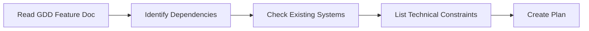

## 🔄 Feature Implementation Workflow

This workflow defines the step-by-step process for AI agents (and developers) to implement a new gameplay feature from concept to verification.

---

### Phase 0: Understand Requirements



**Steps:**

1. **Read the GDD** — Find the relevant design document in `GDD_Design/`
2. **Read the Technical Spec** — Check `GDD_Technical/` for related system docs
3. **Read Coding Standards** — Review [CodingStandards.md](../../GDD_Technical/CodingStandards.md)
4. **Identify module** — Determine which module/plugin this feature belongs to
5. **List dependencies** — What existing classes/systems does this feature need?
6. **Check for conflicts** — Will this break existing systems?

**Output:** Implementation plan with file list and dependency graph.

---

### Phase 1: Create Data Layer

Create the data structures and enums first (no logic yet):

1. **Define enums** (`E` prefix) in the Core module
2. **Define structs** (`F` prefix) for data containers
3. **Define interfaces** (`I` prefix) for cross-module communication
4. **Define Gameplay Tags** in the appropriate `.ini` file
5. **Create Data Assets** (`DA_` prefix) if needed

```cpp
// Example: New "Extraction Zone" feature

// 1. Enum (in ExtractionCore)
UENUM(BlueprintType)
enum class EExtractionZoneState : uint8
{
    Inactive,
    Active,
    Occupied,
    Extracting,
    Completed,
};

// 2. Struct (in ExtractionCore)
USTRUCT(BlueprintType)
struct FExtractionZoneConfig
{
    GENERATED_BODY()
    
    UPROPERTY(EditDefaultsOnly, Category = "Extraction")
    float ExtractionTime = 7.f;
    
    UPROPERTY(EditDefaultsOnly, Category = "Extraction")
    int32 MaxPlayers = 4;
};

// 3. Interface (in ExtractionCore)
UINTERFACE(MinimalAPI)
class UExtractable : public UInterface
{
    GENERATED_BODY()
};

class IExtractable
{
    GENERATED_BODY()
public:
    virtual bool CanExtract() const = 0;
    virtual void OnExtractionStarted() = 0;
    virtual void OnExtractionCompleted() = 0;
};
```

---

### Phase 2: Implement Core Logic

Build the main classes:

1. **Create the primary class** (Actor, Component, or Subsystem)
2. **Use `#pragma region`** to organize by feature area
3. **Add UPROPERTY/UFUNCTION** with proper categories
4. **Implement the constructor** with default values
5. **Implement lifecycle** (BeginPlay, EndPlay)
6. **Implement core logic** with null checks and early returns

**Quality Checklist:**
- [ ] All pointers validated before use
- [ ] `Super::` called in all overrides
- [ ] Delegates broadcast on state changes
- [ ] Log messages using module log category
- [ ] No tick unless absolutely necessary

---

### Phase 3: Add Replication (If Multiplayer)

1. **Mark replicated properties** with `Replicated` or `ReplicatedUsing`
2. **Implement `GetLifetimeReplicatedProps()`**
3. **Create Server RPCs** for client → server actions
4. **Create Client RPCs** for server → client notifications
5. **Create OnRep functions** for replicated property changes

```cpp
void AExtractionZone::GetLifetimeReplicatedProps(TArray<FLifetimeProperty>& OutLifetimeProps) const
{
    Super::GetLifetimeReplicatedProps(OutLifetimeProps);
    
    DOREPLIFETIME(AExtractionZone, ZoneState);
    DOREPLIFETIME_CONDITION(AExtractionZone, ExtractionProgress, COND_OwnerOnly);
}
```

---

### Phase 4: Create UI

1. **Create Widget Blueprint** (`WBP_` prefix)
2. **Create C++ Widget class** (`U` prefix, inheriting `UUserWidget`)
3. **Bind to delegates** from the gameplay class
4. **Follow UI naming** from CodingStandards

---

### Phase 5: Integrate & Test

1. **Create test level** in `Content/Maps/Test/`
2. **Add Blueprint test actor** if needed
3. **Verify compilation** — zero warnings
4. **Test in PIE** — Play-In-Editor with multiple clients
5. **Verify replication** — Check server/client sync
6. **Check performance** — No unnecessary ticks or allocations

---

### Phase 6: Document

1. **Update GDD** if behavior differs from spec
2. **Add code comments** (JavaDoc-style)
3. **Update TODO list** in relevant technical doc
4. **Update changelog** in the document footer
