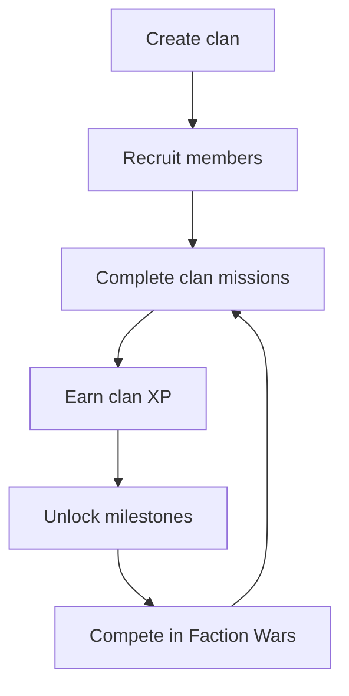

## Overview

Clans create long-term social identity, shared goals, and group competition without forcing every player into organized play.

## Clan Lifecycle

## Creation Rules

| Requirement | Direction |
| :--- | :--- |
| Account level | Minimum level to prevent spam |
| Creation cost | Credit sink |
| Name rules | Profanity filter and uniqueness |
| Tag rules | Short, readable, moderated |
| Initial cap | Modest member cap, expandable through levels |

## Roles And Permissions

| Role | Permissions |
| :--- | :--- |
| Leader | Full control, disband, promote, bank policy |
| Officer | Invite, kick lower ranks, start missions |
| Veteran | Invite and manage mission participation |
| Member | Contribute and receive rewards |
| Recruit | Limited access until trusted |

## Clan Progression

| Source | Contribution |
| :--- | :--- |
| Clan missions | Primary clan XP |
| Faction Wars | Event contribution and leaderboard points |
| Squad extraction | Small contribution when clanmates play together |
| Donations | Controlled contribution to clan bank |

## Clan Bank

| Rule | Requirement |
| :--- | :--- |
| Deposits | Credits and event materials only |
| Withdrawals | Role-gated |
| Audit log | Required |
| Power limit | Cannot create pay-to-win gear funnel |

## Cross-References

| Topic | Page |
| :--- | :--- |
| Faction Wars | [Live Operations](liveops.html) |
| Profile clan display | [Player Profile](playerprofile.html) |
| Ranked clan leaderboard | [Ranked Mode](rankedmode.html) |
| Clan economy | [Economy](economy.html) |
