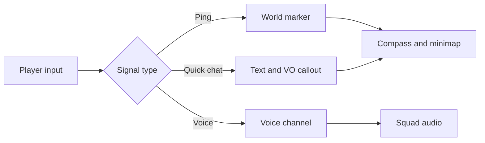

## Overview

Communication supports squad tactics without requiring voice chat. Pings, quick chat, map markers, and voice channels must work together.

## Signal Flow

## Communication Pillars

| Pillar | Rule |
| :--- | :--- |
| Fast | One tap must communicate common intent |
| Non-verbal first | Players can coordinate without microphone |
| Context-aware | Ping system should infer loot, enemy, route, extraction |
| Anti-toxic | Mute, report, filters, and penalties are built in |
| Accessible | Visual alternatives for audio signals |

## Voice Channels

| Channel | Use | Rule |
| :--- | :--- | :--- |
| Party | Friends before matchmaking | Always private |
| Squad | Teammates in match | Default team voice |
| Proximity | Nearby players if mode allows | Disabled in ranked by default |
| Clan | Out-of-raid social | Optional |

## Ping Types

| Ping | Example | Priority |
| :--- | :--- | :--- |
| Enemy | Seen or suspected enemy | High |
| Loot | Useful item or container | Medium |
| Route | Move here, rotate, avoid | Medium |
| Extraction | Extract now or extraction spotted | High |
| Help | Need revive, healing, ammo | High |
| Confirm | Yes, ready, understood | Low |

## Anti-Toxicity Rules

| Tool | Requirement |
| :--- | :--- |
| Mute | Fast, per-player, persistent option |
| Report | Available from match and profile |
| Profanity filter | On by default |
| Voice abuse | Escalates from mute to queue restrictions |
| Ping spam | Rate limit and local mute |

## Cross-References

| Topic | Page |
| :--- | :--- |
| Ping display | [Navigation & Map](navigationandmap.html) |
| Accessibility alternatives | [Accessibility](accessibility.html) |
| Ranked restrictions | [Ranked Mode](rankedmode.html) |
| Loadout squad voice | [Loadout Preparation](loadoutpreparation.html) |
