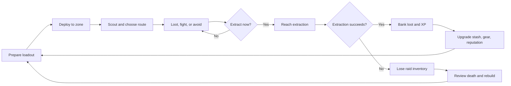
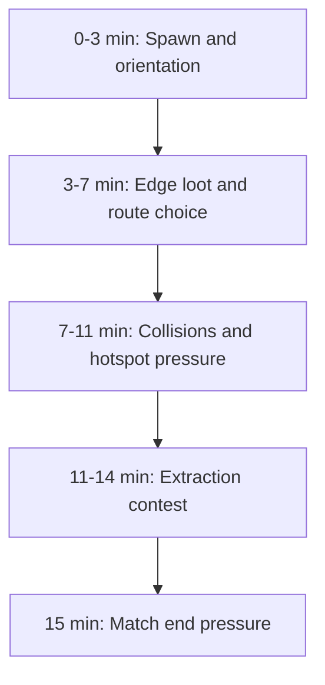
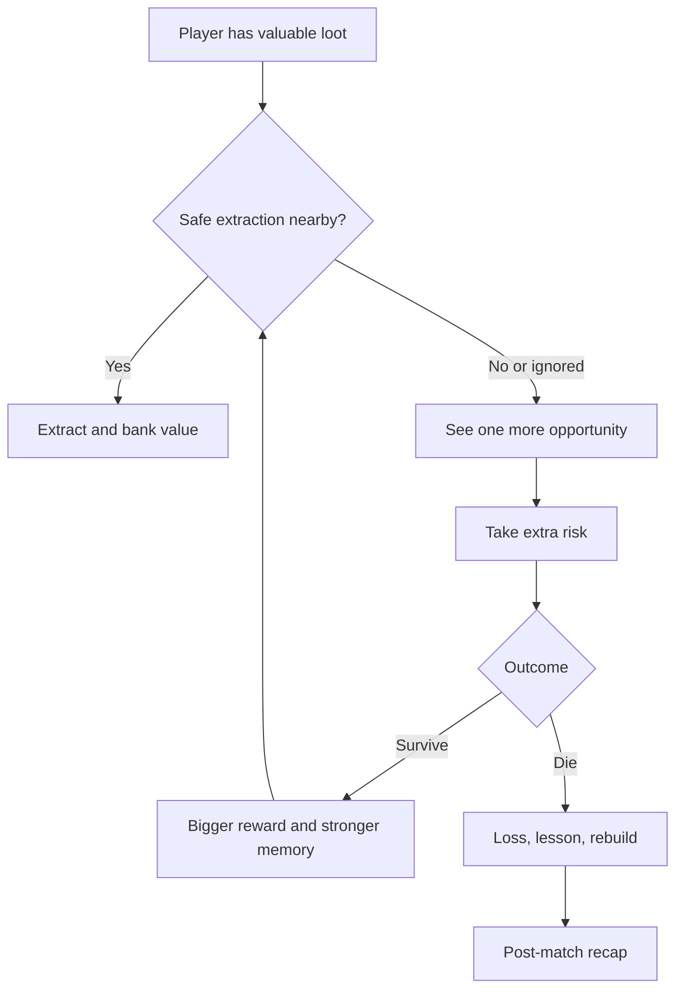
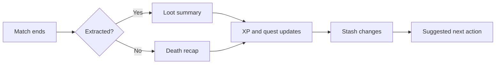

## Overview

Core Gameplay owns the complete raid loop: preparation, deployment, looting, combat, extraction, loss, recovery, and post-match rewards. It defines the experience-level rules and links out to specialist pages for controls, loadout UI, economy, insurance, and maps.

## Key Decisions

| Decision | Direction |
| :--- | :--- |
| Match type | PvPvE extraction raid |
| Target raid length | 10-15 minutes |
| Target session length | 25-40 minutes, usually 2-3 raids |
| Primary skill | Tactical decision making, map knowledge, risk reading |
| Primary tension | Brought gear and found loot can be lost before extraction |
| Safety net | Account progress, stash items, quest progress, and secured items persist |

## Raid Loop

## Pre-Match Phase

The pre-match phase is a deliberate ritual. The player should understand the risk they are choosing before pressing Deploy.

| Step | Player Question | Canonical Detail |
| :--- | :--- | :--- |
| Select objective | What am I trying to accomplish this raid? | [Game Modes](gamemodes.html) |
| Select operator | Which ability and role fits the goal? | Character docs |
| Build loadout | How much am I willing to risk? | [Loadout Preparation](loadoutpreparation.html) |
| Choose insurance | Which items deserve recovery protection? | [Insurance System](insurancesystem.html) |
| Choose map and squad | Where are we going, and with whom? | [Map Design](mapdesign.html), [Communication](communication.html) |
| Confirm deploy | Does the expected reward justify the risk? | This page |

## In-Match Phase

| Phase | Design Intent | Pressure |
| :--- | :--- | :--- |
| Spawn and orientation | Let squads read map, objective, extraction options | Low |
| Edge loot and route choice | Offer safe value and early decisions | Rising |
| Hotspot pressure | Create player collision around value | High |
| Extraction contest | Force commitment and route discipline | Very high |
| Match end | Prevent endless looting and camping | Extreme |

## Combat And Looting Rules

| System | Rule | Why It Matters |
| :--- | :--- | :--- |
| Combat | Positioning and cover should matter more than raw aim speed | Supports top-down mobile tactics |
| TTK | Fast enough to punish mistakes, slow enough for counterplay | Avoids both arcade sponge combat and instant frustration |
| Loot value | Value increases with danger and travel cost | Makes route planning meaningful |
| Sound | Gunfire, footsteps, alarms, and extraction cues create risk information | Turns audio into tactical data |
| AI | AI protects value, reveals player position, and creates pressure | Avoids empty loot runs |
| Extraction | Extraction must be readable, interruptible, and risky | Makes the final choice memorable |

## Greed Loop

## Death, Extraction, And Recovery

| Outcome | Lost | Preserved | Follow-Up |
| :--- | :--- | :--- | :--- |
| Successful extraction | Consumables used during raid | Found loot, XP, quest progress, insured item status | Sell, stash, upgrade, queue next raid |
| Death in raid | Brought gear, backpack loot, unprotected items | Account XP, stash at home, secure container contents, quest knowledge | Death recap, insurance wait, rebuild |
| Timeout | Treated as failed extraction | Account progress and protected systems | Clear warning and recap |

## Post-Match Flow

## Advanced Mechanics

| Mechanic | Purpose | Detail Owner |
| :--- | :--- | :--- |
| Squad coordination | Give teams shared information without removing tension | [Communication](communication.html) |
| Information warfare | Make sensors, pings, and sound meaningful | [Navigation & Map](navigationandmap.html) |
| Insurance | Reduce loss frustration without deleting risk | [Insurance System](insurancesystem.html) |
| Ranked rule changes | Preserve competitive integrity | [Ranked Mode](rankedmode.html) |
| Scavenger runs | Provide low-stakes recovery and practice | [Game Modes](gamemodes.html) |

## Metrics

| Metric | Target | Notes |
| :--- | :--- | :--- |
| Overall extraction rate | 30-40% | Tune by skill bracket and mode |
| Beginner extraction rate | 20-30% | Tutorial and protected queues should support learning |
| Average raid length | 10-15 minutes | Avoid PC-scale session bloat |
| Menu time per session | Under 20% | Loadout prep should feel meaningful, not slow |
| Death recap usefulness | High qualitative score | Players should know what to improve |

## Cross-References

| Topic | Page |
| :--- | :--- |
| Loadout UI | [Loadout Preparation](loadoutpreparation.html) |
| Input and camera | [Controls](controls.html) |
| Map routes and extraction placement | [Map Design](mapdesign.html) |
| Insurance rules | [Insurance System](insurancesystem.html) |
| Economy impact | [Economy](economy.html) |
| Onboarding | [Tutorial Raid](tutorialraid.html) |
