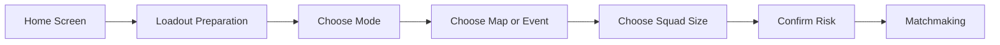

## Overview

Game modes define why players enter the extraction loop and what rules shape each run. The Raid is the core experience; all other modes must support onboarding, recovery, competition, or live operations without diluting the extraction identity.

## Mode Selection Flow

## Mode Catalogue

| Mode | Purpose | Risk | Squad Size | Notes |
| :--- | :--- | :--- | :--- | :--- |
| The Raid | Core extraction experience | Normal | Solo, Duo, Trio | Full loot, full progression, insurance supported |
| Scavenger Run | Recovery and practice | Low | Solo, Duo | Free temporary kit, limited rewards, no insurance |
| Blitz | Short session quick play | Medium | Solo, Duo, Trio | Faster timer, reduced map size, faster extraction pressure |
| Ranked Operations | Competitive extraction | High | Solo, Duo, Trio | RP enabled, stricter matchmaking, limited rule changes |
| Co-op Training | Low-pressure mastery | Low | Solo, Duo, Trio | PvE learning, no premium rewards |
| Featured Mode | Live Ops variety | Variable | Event-defined | Rotates through seasonal rules |

## Core Mode Rules

### The Raid

The Raid is the reference mode. Balance, economy, onboarding, and map design should be judged against this mode first.

| Parameter | Target |
| :--- | :--- |
| Match length | 10-15 minutes |
| Player count | Tuned per map size |
| AI threat | Present around loot and objectives |
| Gear loss | Enabled |
| Insurance | Enabled |
| Quest progress | Enabled |

### Scavenger Run

Scavenger Run prevents poverty spirals and gives players a way to practice routes without risking their stash.

| Rule | Direction |
| :--- | :--- |
| Starting kit | Randomized low-value kit |
| Cooldown | Required to prevent farming |
| Rewards | Extracted loot allowed, but lower ceiling than The Raid |
| Progression | Limited account XP, no ranked progress |

### Ranked Operations

Ranked Operations uses the core extraction loop with stricter competitive rules. Full RP design lives in [Ranked Mode](rankedmode.html).

| Rule | Direction |
| :--- | :--- |
| Matchmaking | Rank-aware, latency-aware, anti-smurf monitored |
| Insurance | Disabled or restricted per season rules |
| Rewards | Rank points, cosmetics, leaderboard position |
| Integrity | Stronger penalties for disconnects, boosting, and collusion |

## Mode Card Requirements

| Field | Required |
| :--- | :--- |
| Mode name | Yes |
| Risk level | Yes |
| Estimated raid length | Yes |
| Gear loss rules | Yes |
| Insurance rules | Yes |
| Squad sizes | Yes |
| Reward type | Yes |
| Event timer | Only for featured modes |

## Cross-References

| Topic | Page |
| :--- | :--- |
| Prep screen integration | [Loadout Preparation](loadoutpreparation.html) |
| Ranked rules | [Ranked Mode](rankedmode.html) |
| Event rotations | [Live Operations](liveops.html) |
| Map rules | [Map Design](mapdesign.html) |
| Insurance mode differences | [Insurance System](insurancesystem.html) |
