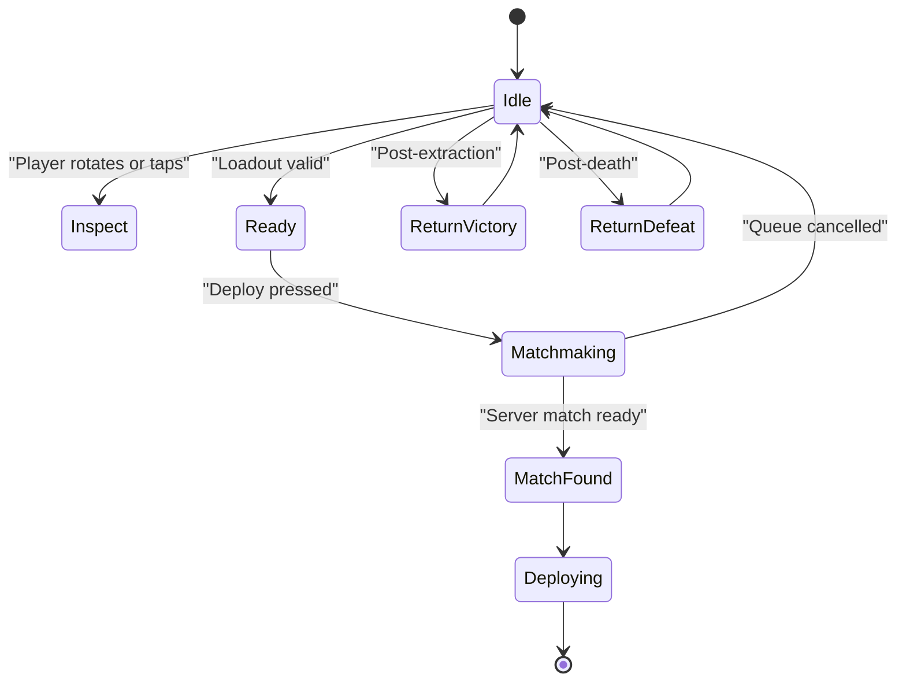
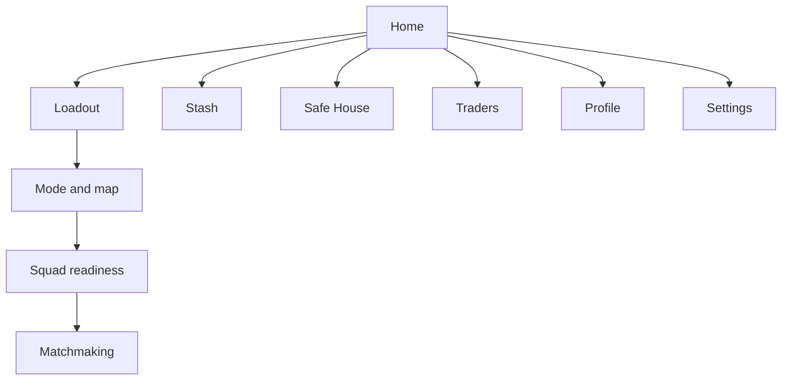

## Overview

The Home Screen is the player's out-of-raid command center. It should show identity, current goals, squad readiness, live events, and the fastest route back into a raid.

## Key Decisions

| Area | Direction |
| :--- | :--- |
| Primary emotion | Readiness and tension before deployment |
| Main focus | Operator showcase plus Deploy path |
| Secondary focus | Progress, events, squad, stash reminders |
| Mobile layout | One clear vertical flow with bottom navigation |
| PC/console layout | Operator center, navigation rail, contextual panels |

## Operator Showcase States

## PC / Console Layout

| Region | Content | Purpose |
| :--- | :--- | :--- |
| Center | Operator showcase, stance, selected skin, weapon preview | Identity and readiness |
| Left rail | Home, Armory, Stash, Safe House, Traders, Ranked, Shop, Settings | Stable global navigation |
| Right panel | Mode card, squad status, quick deploy, queue estimate | Fast path to play |
| Top bar | Currency, notifications, profile, season timer | Account state |
| Bottom strip | Last raid, active quests, event reminder | Contextual next actions |

## Mobile Layout

| Region | Content | Purpose |
| :--- | :--- | :--- |
| Top | Currency, profile, notifications | Account state |
| Main | Operator showcase and selected loadout summary | Identity and readiness |
| Middle | Deploy card, current mode, squad size | Fast path to play |
| Feed | Event banner, daily goals, last raid | Return hooks |
| Bottom nav | Home, Loadout, Stash, Social, Shop, Settings | Thumb reachable navigation |

## Navigation Flow

## Deploy Panel Requirements

| Field | Requirement |
| :--- | :--- |
| Selected mode | Always visible |
| Squad size | Always visible |
| Gear value | Visible before deploy |
| Insurance status | Visible if eligible items are uninsured |
| Quest suggestions | Show top 1-3 relevant goals |
| Queue estimate | Update periodically during matchmaking |
| Risk warning | Trigger if player deploys with unusually high value |

## News And Events

| Surface | Rule |
| :--- | :--- |
| Event banner | One primary event at a time |
| Patch notes | Link to readable detail, not modal overload |
| Daily goals | Show progress and time remaining |
| Deep links | Event cards must open the exact target screen |
| Dismissal | Dismissed news should not reappear until updated |

## Audio And Feedback

| State | Audio Direction |
| :--- | :--- |
| Idle | Low industrial ambience |
| Queue searching | Subtle tension layer |
| Match found | Short confirmation sting |
| Post-extraction | Brief relief cue |
| Post-death | Somber recovery cue |

## Cross-References

| Topic | Page |
| :--- | :--- |
| Deploy flow | [Loadout Preparation](loadoutpreparation.html) |
| Modes | [Game Modes](gamemodes.html) |
| Progress summary | [Progression](progression.html) |
| Events feed | [Live Operations](liveops.html) |
| Safe House | [Safe House Design](safe_house_design.html) |
| Settings | [User Settings](usersettings.html) |
