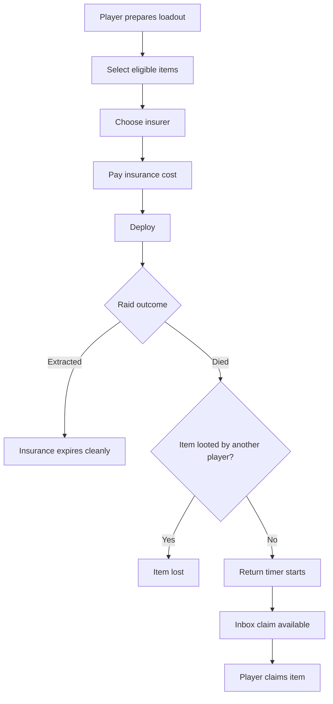

## Overview

Insurance softens gear loss without removing risk. It lets players pay before a raid for a chance to recover eligible items that were not extracted by another player.

## Key Decisions

| Area | Direction |
| :--- | :--- |
| Primary purpose | Reduce frustration after death while preserving gear fear |
| Purchase moment | Loadout Preparation |
| Return condition | Item must remain unlooted or recoverable after raid resolution |
| Return timing | Delayed inbox claim, not instant refund |
| Economy role | Credit sink and retention safety valve |
| Competitive rules | Ranked can restrict or disable insurance |

## Insurance Lifecycle



## Insurer Options

| Insurer | Positioning | Cost | Return Time | Strength |
| :--- | :--- | :--- | :--- | :--- |
| Viktor Kozlov | Salvage Corps recovery | Lower | Slower | Good for budget and standard gear |
| Ada Chen | Tech Syndicate priority recovery | Higher | Faster | Good for rare or tactical gear |

## Item Eligibility

| Item Type | Insurable | Notes |
| :--- | :--- | :--- |
| Weapons | Yes | Cost scales with base value and condition |
| Armor | Yes | Damaged gear returns damaged unless repaired separately |
| Backpack | Yes | Backpack returns empty if contents are not insured separately |
| Consumables | No | Used or lost as part of raid risk |
| Quest items | Usually no | Prevents bypassing quest risk |
| Secure container contents | Not needed | Already protected by secure container rules |
| Cosmetics | No | Not lost in raid |

## Cost Formula

```text
Insurance Cost = Item Base Value x Insurer Rate x Condition Modifier x Risk Modifier
```

| Modifier | Purpose |
| :--- | :--- |
| Item Base Value | Makes expensive gear more costly to protect |
| Insurer Rate | Differentiates recovery services |
| Condition Modifier | Reduces cost for heavily damaged gear |
| Risk Modifier | Allows mode or event tuning |

## UX Flow

| Screen | Player Action | Feedback |
| :--- | :--- | :--- |
| Loadout Preparation | Toggle insurance per item or use insure-all | Cost preview and insurer comparison |
| Raid Recap | See insured item status | Returned, looted, pending, or lost |
| Safe House Inbox | Claim returned items | Timer, item condition, and storage warning |
| Economy Summary | See insurance spend | Helps players learn cost discipline |

## Edge Cases

| Case | Rule |
| :--- | :--- |
| Player disconnects | Resolve based on final raid state |
| Item is looted then dropped | Counts as looted unless recovery rules explicitly allow recheck |
| Inventory full on claim | Hold in inbox until space is available |
| Seasonal wipe | Wipe rules override pending insurance unless event policy says otherwise |
| Ranked Ops | Insurance disabled or restricted by season config |

## Cross-References

| Topic | Page |
| :--- | :--- |
| Pre-raid insurance UI | [Loadout Preparation](loadoutpreparation.html) |
| Gear loss rules | [Core Gameplay](coregameplay.html) |
| Credit sinks | [Economy](economy.html) |
| Safe House inbox | [Safe House Design](safe_house_design.html) |
| Ranked restrictions | [Ranked Mode](rankedmode.html) |
