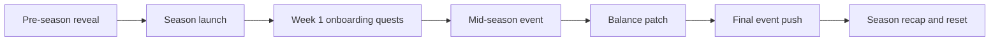
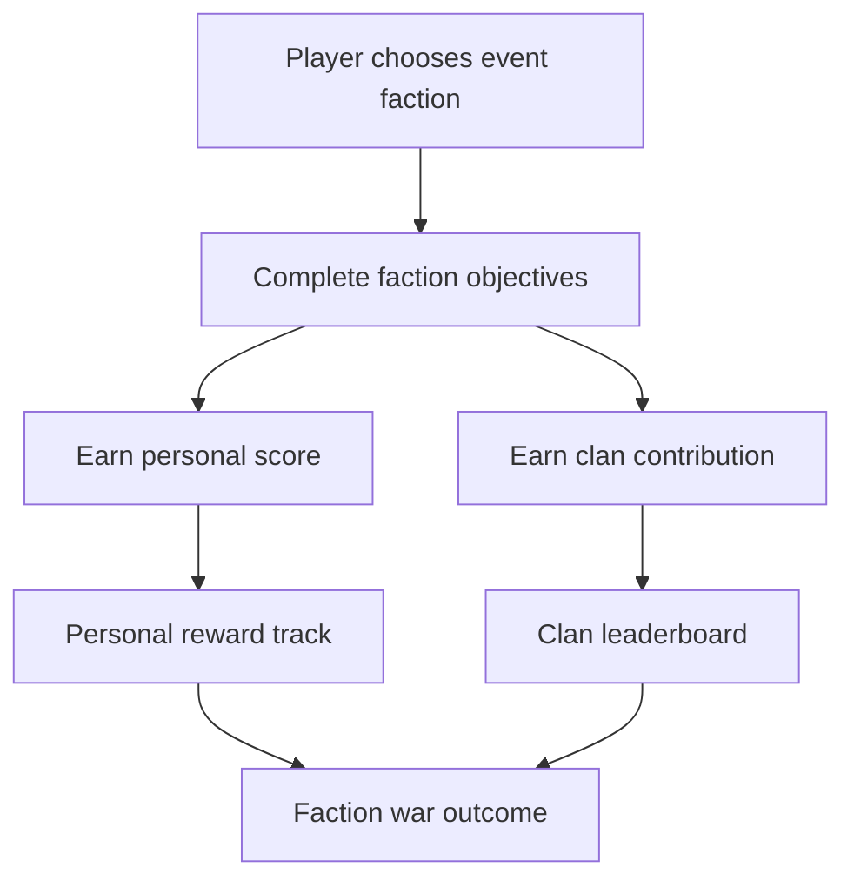

## Overview

Live Ops keeps the game fresh after launch through seasons, events, featured modes, balance updates, battle pass content, faction wars, and community beats.

## Cadence

| Cadence | Content | Purpose |
| :--- | :--- | :--- |
| Weekly | Rotating quests, small modifiers, featured shop refresh | Habit and variety |
| Monthly | Balance patch, event beat, small content drop | Meta health |
| Seasonal | Battle pass, theme, ranked reset, major event | Long-term return |
| Yearly | Major map, feature, or expansion | Reposition and re-engage |

## Season Flow

## Event Types

| Event | Duration | Gameplay Impact | Reward Type |
| :--- | :--- | :--- | :--- |
| Double XP / Credits | Weekend | Progress acceleration | XP, credits |
| Limited-Time Mode | 1-2 weeks | New mode rules | Cosmetics, event currency |
| Faction Wars | 2-4 weeks | Community alignment and clan goals | Banners, titles, faction cosmetics |
| Boss Hunt | 1-2 weeks | Hotspot objective and rare loot | Unique cosmetics, trophies |
| Collection Event | 2 weeks | Collect event currency through raids | Themed cosmetics |

## Featured Mode Rules

| Mode | Modifier | Risk |
| :--- | :--- | :--- |
| Night Ops | Low visibility, stronger audio play | Medium |
| Extraction Rush | Shorter timer, faster extracts | High |
| Hardcore | Reduced HUD, stricter loss rules | Very high |
| Solo Showdown | Solo-only matchmaking | Medium |
| Chaos Mode | Increased events and AI pressure | High |

## Faction Wars

## Live Ops Guardrails

| Guardrail | Rule |
| :--- | :--- |
| No event-only power | Event rewards cannot create permanent combat advantage |
| Avoid burnout | Weekly goals must be achievable without unhealthy playtime |
| Maintain economy health | Event rewards must respect item supply and currency sinks |
| Protect ranked integrity | Ranked rule changes must be announced and measurable |
| Keep content readable | Event modifiers must not break mobile clarity |

## Cross-References

| Topic | Page |
| :--- | :--- |
| Battle pass progression | [Progression](progression.html) |
| Economy rewards | [Economy](economy.html) |
| Featured modes | [Game Modes](gamemodes.html) |
| Ranked seasons | [Ranked Mode](rankedmode.html) |
| Clan competition | [Clan System](clansystem.html) |
