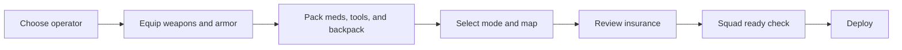

## Overview

Loadout Preparation is the ritual before risk. It must help players understand what they are bringing, what they can lose, which objective they are chasing, and whether the squad is ready.

## Key Decisions

| Area | Direction |
| :--- | :--- |
| Primary job | Make risk legible before deploy |
| Core surfaces | Operator, gear, stash, insurance, mode, map, squad |
| PC layout | Multi-column workbench |
| Mobile layout | Tabbed flow with persistent summary |
| Deploy gate | Block only critical invalid states |

## Loadout Flow

## PC / Console Layout

| Region | Content | Purpose |
| :--- | :--- | :--- |
| Left column | Operator, gear slots, weight, insurance status | Read loadout at a glance |
| Center column | Stash grid, filters, item details | Equip and manage items |
| Right column | Mode, map, quests, squad, deploy button | Commit to raid |
| Footer | Loadout value, risk warnings, preset controls | Keep risk visible |

## Mobile Layout

| Tab | Content | Persistent Element |
| :--- | :--- | :--- |
| Operator | Character, ability, armor slots | Loadout value |
| Gear | Weapons, ammo, meds, backpack | Weight and warning |
| Stash | Inventory grid and filters | Quick equip actions |
| Mission | Mode, map, quests | Deploy readiness |
| Squad | Party, voice, ready state | Deploy button |

## Loadout Summary

| Signal | Display Rule |
| :--- | :--- |
| Gear value | Always visible before deploy |
| Weight | Show current and max carry weight |
| Ammo readiness | Warn if weapon has no compatible ammo |
| Healing readiness | Warn if no healing item is equipped |
| Insurance | Show insured, uninsured, and ineligible counts |
| Quest items | Highlight required equipment or objectives |

## Presets

| Preset Type | Purpose |
| :--- | :--- |
| Budget | Low-risk recovery and practice |
| Standard | Balanced raid kit |
| Objective | Quest-specific gear |
| Squad Role | Team role kit such as scout, medic, anchor |
| Custom | Player-defined saved loadout |

## Deploy Validation

| State | Behavior |
| :--- | :--- |
| Missing weapon | Block deploy |
| Missing ammo | Warn, allow only with explicit confirmation |
| Overweight | Block or force item removal |
| High gear value | Warn |
| No insurance | Warn if eligible items are present |
| Squad not ready | Wait until all required players ready |

## Cross-References

| Topic | Page |
| :--- | :--- |
| Core raid loop | [Core Gameplay](coregameplay.html) |
| Insurance | [Insurance System](insurancesystem.html) |
| Economy and gear value | [Economy](economy.html) |
| Controls and mobile input | [Controls](controls.html) |
| Map and mode choice | [Map Design](mapdesign.html), [Game Modes](gamemodes.html) |
