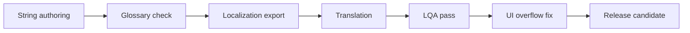

## Overview

Localization ensures the game can ship clearly across target markets without breaking UI layout, tutorial clarity, monetization transparency, or cultural expectations.

## Language Tiers

| Tier | Languages | Target |
| :--- | :--- | :--- |
| Tier 1 | English, Vietnamese, Thai, Indonesian, Portuguese, Spanish | Launch or early launch markets |
| Tier 2 | French, German, Japanese, Korean, Simplified Chinese | Expansion markets |
| Tier 3 | Additional regional languages | Post-launch based on demand |

## Text Rules

| Rule | Requirement |
| :--- | :--- |
| Use placeholders | Write `Extract {0} items`, not hardcoded numbers |
| Avoid text in images | UI art must support translation |
| Allow expansion | UI must handle 30-50% longer strings |
| Use glossary | Terms like extract, stash, insured, faction, operator must stay consistent |
| Keep tone consistent | Tactical, clear, not overly slang-heavy |

## Voice Strategy

| Content | Localization Direction |
| :--- | :--- |
| Critical tutorial VO | Localize for Tier 1 where budget allows |
| Operator barks | Subtitle all, dub selectively |
| System callouts | Prefer concise localized text and icon support |
| Seasonal narrative | Localize text first, dub by market priority |

## Cultural Review

| Area | Review Need |
| :--- | :--- |
| Faction names | Avoid unintended political or cultural offense |
| Cosmetics | Check symbols, colors, and gestures |
| Monetization | Ensure regional legal compliance |
| Age ratings | Check violence, chat, purchases, and user-generated content |

## Localization Pipeline

## Cross-References

| Topic | Page |
| :--- | :--- |
| Settings language options | [User Settings](usersettings.html) |
| Tutorial text | [Tutorial Raid](tutorialraid.html) |
| Accessibility text scale | [Accessibility](accessibility.html) |
