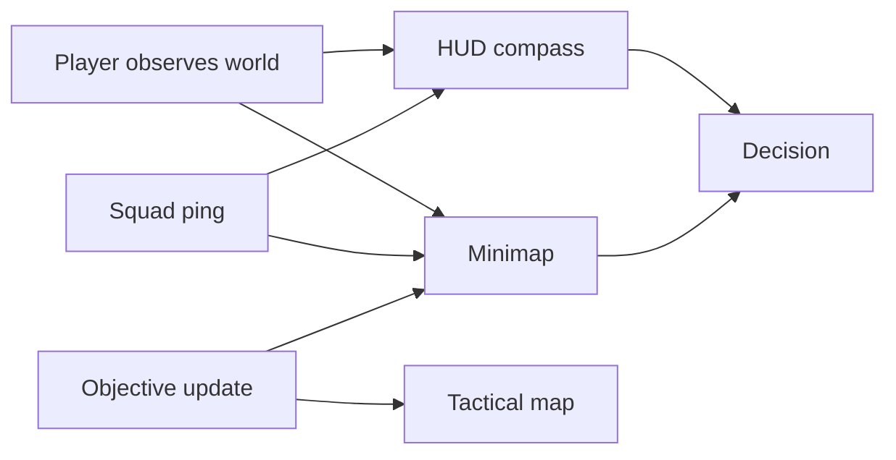

## Overview

Navigation systems help players understand where they are, where danger may be, where objectives are, and how to extract. They must support tactical decision-making without revealing too much information.

## System Layers

| Layer | Purpose | Visibility |
| :--- | :--- | :--- |
| Compass ring | Directional awareness and pings | Always visible, compact |
| Minimap | Nearby terrain, squad, objective hints | HUD element |
| Tactical map | Full route planning | Opened by player |
| World markers | In-world objective and ping direction | Contextual |
| Audio cues | Directional threat and extraction information | Always active if audible |

## Navigation Signal Flow

## Compass Rules

| Signal | Display |
| :--- | :--- |
| Cardinal direction | Always shown |
| Squad ping | Direction, distance, short label |
| Gunfire | Directional pulse if heard |
| Extraction | Direction only after discovered or assigned |
| Danger zone | Warning wedge, not exact player reveal |

## Minimap Rules

| Element | Rule |
| :--- | :--- |
| Player | Centered or offset by movement direction |
| Squad | Always visible if connected |
| Enemies | Never permanently visible by default |
| AI | Visible only through scan, noise, or objective rules |
| Loot | Not globally shown; markers only after discovery |
| Extraction | Shows assigned and discovered extracts |

## Tactical Map

| Feature | Requirement |
| :--- | :--- |
| Pan and zoom | Touch and controller friendly |
| Floor support | Clear floor selector for multi-level spaces |
| Objectives | Filterable quest, squad, and extraction markers |
| Route planning | Player can place personal waypoint |
| Risk info | Zone danger tiers and event areas shown if known |

## Ping System

| Ping | Input | Result |
| :--- | :--- | :--- |
| Context ping | Tap / quick press | Marks object, location, enemy, loot, or route |
| Ping wheel | Hold | Lets player choose intent |
| Danger ping | Enemy or suspicious area | Higher priority visual and audio |
| Objective ping | Quest or extraction | Shared with squad |
| Cancel ping | Re-tap or menu action | Removes marker |

## Cross-References

| Topic | Page |
| :--- | :--- |
| Map rules | [Map Design](mapdesign.html) |
| Communication and pings | [Communication](communication.html) |
| Controls | [Controls](controls.html) |
| Accessibility alternatives | [Accessibility](accessibility.html) |
