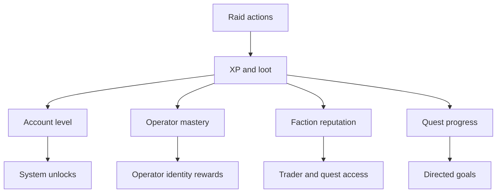

## Overview

Progression owns the systems that make players return: account levels, operator mastery, faction reputation, quests, battle pass advancement, achievements, and long-term goals.

## Progression Layers

## Account Levels

| Area | Direction |
| :--- | :--- |
| Level range | Launch target: 1-50 |
| Primary source | Raid XP, quest completion, event objectives |
| Unlock cadence | Meaningful unlock or reward every 5 levels |
| Prestige | Post-launch system, cosmetic-first |
| Loss rules | Account XP is never lost on death |

## Operator Mastery

| Tier | Player Meaning | Reward Type |
| :--- | :--- | :--- |
| 0-2 | Learning the role | Starter cosmetics, tips, basic mastery badges |
| 3-5 | Comfortable play | Voice lines, skins, minor convenience unlocks |
| 6-8 | Specialist identity | Advanced cosmetics, profile badges |
| 9-10 | Dedicated mastery | Prestige cosmetics, title, showcase treatment |

Operator mastery should reward commitment without creating mandatory stat grind.

## Quest System

| Quest Type | Reset | Purpose |
| :--- | :--- | :--- |
| Tutorial | One-time | Teach survival basics |
| Daily | 24 hours | Short-term goals and return habit |
| Weekly | 7 days | Medium goals and varied play |
| Faction | Persistent | World identity, reputation, and trader unlocks |
| Story | One-time chains | Narrative and directed exploration |
| Seasonal | Season-limited | Live Ops engagement and event identity |

## Battle Pass

| Component | Direction |
| :--- | :--- |
| Tracks | Free and premium |
| Reward type | Cosmetics, currency, materials, boosts that do not sell combat power |
| Progress sources | Raid XP, quests, event challenges |
| Catch-up | Late-season missions or boosted objectives |
| Integrity | No paid combat advantage |

## Retention Loops

| Timeframe | Player Goal | System Support |
| :--- | :--- | :--- |
| Day 1 | Learn extraction and bank first win | Tutorial Raid, starter quests |
| Week 1 | Build stash and choose favorite operator | Daily quests, operator mastery |
| Month 1 | Unlock traders and understand economy | Faction reputation, Safe House upgrades |
| Season | Complete battle pass and event goals | Live Ops, ranked, clan missions |
| Long term | Master roles and build identity | Achievements, cosmetics, profile, prestige |

## Anti-Frustration Rules

| Risk | Mitigation |
| :--- | :--- |
| New player loses everything | Starter kits, Scavenger Run, protected onboarding |
| Player has no goal | Daily/weekly/faction quest surfacing |
| Progress feels paywalled | Earnable paths for convenience and cosmetics |
| Meta becomes stale | Live Ops events, balance patches, rotating objectives |

## Cross-References

| Topic | Page |
| :--- | :--- |
| Economy and monetization ethics | [Economy](economy.html) |
| Event cadence | [Live Operations](liveops.html) |
| Player stats and achievements | [Player Profile](playerprofile.html) |
| Tutorial goals | [Tutorial Raid](tutorialraid.html) |
| Clan missions | [Clan System](clansystem.html) |
