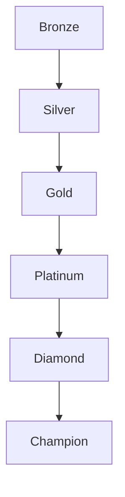

## Overview

Ranked Mode adds competitive stakes to extraction without turning the game into pure deathmatch. Success should reward extraction discipline, objective play, combat skill, and survival.

## Rank Ladder

## RP Inputs

| Input | Direction |
| :--- | :--- |
| Extraction | Primary positive RP source |
| Objective completion | Strong positive modifier |
| Combat performance | Positive, capped to avoid kill farming |
| Loot value extracted | Positive, capped by rank/mode |
| Death | Negative |
| Early disconnect | Strong negative unless protected by reconnect rules |

## Queue Rules

| Rule | Direction |
| :--- | :--- |
| Account requirement | Minimum level and tutorial completion |
| Squad rank spread | Limit rank gap for fairness |
| Map rotation | Seasonal and announced |
| Insurance | Disabled or restricted |
| Matchmaking | Rank, latency, party size, and integrity signals |

## Season Structure

| Phase | Purpose |
| :--- | :--- |
| Placement | Establish starting rank |
| Climb | Core ranked season |
| Mid-season patch | Balance and integrity update |
| Final push | Increased visibility and rewards |
| Reset | Soft reset plus reward distribution |

## Competitive Integrity

| Risk | Mitigation |
| :--- | :--- |
| Cheating | Anti-cheat, telemetry, review pipeline |
| Boosting | Party rank limits, suspicious pattern detection |
| Collusion | Match history and proximity analysis |
| Smurfing | Account age, performance spikes, phone/platform signals |
| Disconnect abuse | Reconnect window and escalating penalties |

## Rewards

| Reward | Rule |
| :--- | :--- |
| Rank badge | Seasonal, profile-visible |
| Cosmetic | No gameplay advantage |
| Banner/title | Prestige only |
| Leaderboard | Top players and squads |
| Clan contribution | Optional clan leaderboard points |

## Cross-References

| Topic | Page |
| :--- | :--- |
| Core ranked mode rules | [Game Modes](gamemodes.html) |
| Profile display | [Player Profile](playerprofile.html) |
| Communication restrictions | [Communication](communication.html) |
| Economy guardrails | [Economy](economy.html) |
