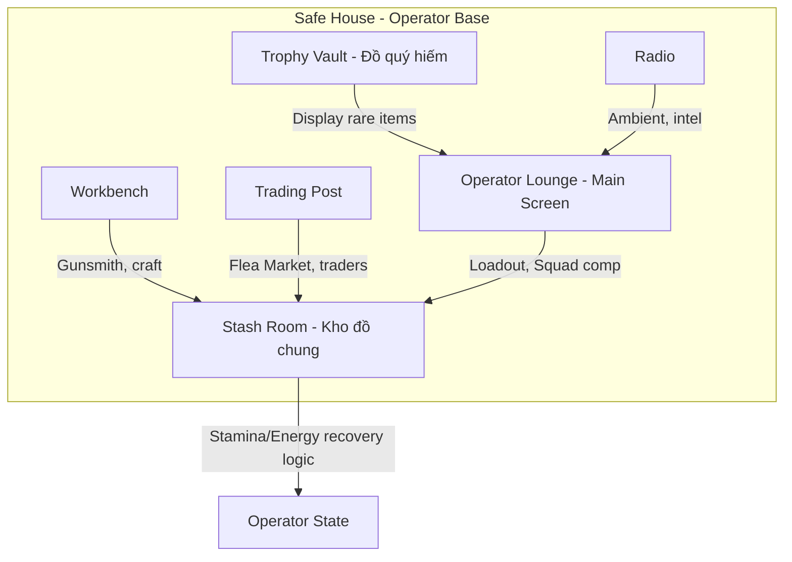

## Overview

The **Safe House** is the player's persistent base of operations — the central hub between raids where Operators reside, manage their stash, craft gear, and prepare for the next deployment. It is a **meta-game hub** (Game Design, not in-raid gameplay): all activities occur out-of-raid.

> **Terminology:** Use **Safe House** (not "Hideout"). **Safehouse** (lore) = Underground faction locations — distinct from the player's Safe House.

> **Cross-References:** [Stash Design](../Stash_Design.md) — Stash Room houses the stash; [Core Gameplay Loop](../Gameplay/CoreLoop.md) — Phase 5 Recovery; [Home Screen Design](HomeScreen_Design.md) — Operator Lounge = main screen view.

---

## 1. Design Philosophy

- **Meaningful investment, not pay-to-win.** Safe House upgrades are bought with raid-earned materials. Real money cannot accelerate upgrades.
- **Passive without being idle-game.** The Safe House produces income while players are offline, but the production ceiling is gated by active play (materials must be looted, quests completed).
- **Upgrade order matters.** Modules have prerequisites — forcing players to plan an upgrade path.
- **Consequence of loss.** A player who dies repeatedly cannot farm Safe House materials. The base naturally falls behind, motivating better play (or more conservative loadouts).

---

## 2. Functional Areas



### 2.1 Stash Room

**Function:** Central inventory repository. All out-of-raid items, loot, and gear are stored here.

- **Grid stash:** Full stash grid; see [Stash Design](../Stash_Design.md)
- **Operator state recovery:** Logic for updating Operator stamina, energy, and hydration between raids (rest, consume food/water from stash)
- **Access:** From Loadout Preparation (quick-access panel) and full Stash screen

### 2.2 Trophy Vault

**Function:** Store and display rare/special items collected by the player.

- **Display slots:** Legendary/Epic items showcased; not used for loadout
- **Showcase for visitors:** Friends visiting Safe House can view the Trophy Vault (view-only)
- **Achievement display:** Season rewards, rare loot, prestige items

### 2.3 Workbench

**Function:** Weapon crafting, modification (Gunsmith), and repair.

- **Weapon modding:** Attach/detach attachments; live stat comparison
- **Crafting recipes:** Suppressors, ammo, grenades (see Module Details)
- **Repair gear:** Restore weapon/armor durability before raid

### 2.4 Radio

**Function:** Ambient music selection, intel, faction radio chatter.

- **Music:** Player-selectable ambient tracks
- **Quest intel:** Available raids, map intel
- **Faction chatter:** Lore and atmosphere

### 2.5 Trading Post

**Function:** Giao dịch với chợ/thế giới bên ngoài.

- **Flea Market / Player Marketplace:** Buy and sell items
- **Traders:** Viktor, Ada, and other faction traders
- **Direct trade:** Player-to-player trading (both confirm; audit trail; anti-RMT limits)

### 2.6 Operator Lounge (Main Screen)

**Function:** Màn hình chính; Operator hiện diện; Loadout, Gunsmith, Squad composition.

- **3D Operator showcase:** Operator model displayed at center viewport
- **Loadout Preparation:** Equip gear, presets, insurance — see [Loadout Preparation](LoadoutPreparation.md)
- **Gunsmith:** Weapon modification access from Operator viewport
- **Squad composition:** Form squad, assign roles, deploy
- **Deploy flow:** Launch into raid from here

---

## 3. Out-of-Raid Operator State

Operator stats recover between raids while in the Safe House.

### 3.1 Stamina (Leg Stamina)

- **Recovery:** Regenerates over time when in Safe House
- **Rest Space module:** Accelerates recovery (reduces Scav cooldown; can extend to stamina)

### 3.2 Energy & Hydration

- **Consume from Stash:** Food and water items in Stash can be consumed in Safe House to restore Energy/Hydration before raid
- **Starting values:** 90 Hydration, 85 Energy at raid start (from [Hydration & Energy](../Gameplay/Hydration_Energy.md))
- **Nutrition Unit:** Crafts Purified Water, Hot Meal for provisioning

### 3.3 Health

- **Heal between raids:** Use medical items from Stash, or craft at Medical Station
- **Medical Station:** Crafts IFAK, painkillers, stimulants

---

## 4. Safe House Modules

### Module Overview

| Module | Function | Max Level | Unlocks |
| :----- | :------- | :-------: | :------ |
| **Stash** | Increases item storage size (grid) | 4 | Core; starts at Level 1 |
| **Workbench** | Weapon crafting and modification | 3 | Level 2 unlocks weapon modding |
| **Medical Station** | Medical item crafting, stimulant creation | 3 | Required for Medic quest chain |
| **Generator** | Powers other modules; determines active module count | 3 | Required before any other upgrade |
| **Scav Box** | Passive low-tier loot generation | 3 | Poor-man's passive income |
| **Bitcoin Farm** | Converts electronics into currency over time | 3 | Main passive income engine |
| **Nutrition Unit** | Food/water crafting for raid provisioning | 2 | Crafts Purified Water, Hot Meal |
| **Intelligence Center** | Reduces quest search time, unlocks bonus quests | 2 | Unlocks trader barter discounts |
| **Shooting Range** | Offline aim training + minor XP bonus | 1 | Quality of life |
| **Rest Space** | Reduces Scav cooldown (20 min → 12 min at max) | 2 | Economy optimization |
| **Vents** | Reduces Safe House maintenance cost (filters, fuel) | 2 | Economy sink mitigation |

### Stash Module

| Level | Grid Size | Unlock Cost | Prerequisite |
| :---- | :-------- | :---------- | :----------- |
| 1 (Starting) | 10×28 (280 slots) | Free | None |
| 2 | 10×38 (380 slots) | $50,000 + 20 Bolts + 10 Wires | Generator Lvl 1 |
| 3 | 10×48 (480 slots) | $150,000 + 3 GPU + 5 Circuit Boards | Generator Lvl 2 |
| 4 | 10×62 (620 slots) | $400,000 + 5 GPU + 10 Mechanical Parts + quest chain | Generator Lvl 3 |

### Generator

Powers all other modules. Required before any upgrade path.

| Level | Active Modules | Fuel Consumption | Unlock Cost |
| :---- | :------------- | :--------------- | :---------- |
| 1 | 1 module active | 1 Fuel Can / 24h | Free (starting) |
| 2 | 3 modules active | 1 Fuel Can / 36h | $30,000 + 5 Wires + 3 Car Batteries |
| 3 | All modules active | 1 Fuel Can / 48h | $80,000 + 3 Spark Plugs + 2 Metal Pipes |

**Fuel management:** Running out of fuel disables all passive modules. See [Economy](Economy.md).

### Workbench

| Level | Unlock | Key Recipe Added |
| :---- | :----- | :--------------- |
| 1 | $20,000 + 5 Bolts + 3 Wires + Gen Lvl 1 | Basic suppressor craft; ammo recasing |
| 2 | $60,000 + 10 Bolts + 5 Metal Pipes + Stash Lvl 2 | Weapon modification; magazine craft |
| 3 | $150,000 + 20 Mechanical Parts + 5 Bearings + quest | Tier 3–4 weapon mod recipes; grenade crafting |

### Medical Station

| Level | Unlock | Key Recipe Added |
| :---- | :----- | :--------------- |
| 1 | $25,000 + 5 Saline + 3 Surgical Instruments + Gen Lvl 1 | Basic meds (AI-2, Bandage ×5) |
| 2 | $70,000 + 10 Saline + 5 Blood Sets + Stash Lvl 2 | IFAK craft; painkiller synthesis |
| 3 | $200,000 + Rare Chemicals + Vents Lvl 2 + quest | Stimulant synthesis (Adrenaline, Propital, Grizzly) |

### Nutrition Unit

| Recipe | Inputs | Craft Time | Output |
| :----- | :------ | :--------: | :----- |
| Purified Water | Water Bottle (dirty) ×2 + Filter ×1 | 1h | 1× Purified Water (+60 Hydration) |
| Hot Meal Pack | Canned Beef ×2 + Provisions ×2 + MRE ×1 | 1.5h | 1× Hot Meal (+60 Energy, +15 Hydration) |

---

## 5. Upgrade Prerequisites (Tech Tree)

```
Generator Lvl 1 (free start)
    ├── Stash Lvl 2
    │       └── Stash Lvl 3
    │               └── Stash Lvl 4 [Generator Lvl 3 req]
    ├── Workbench Lvl 1
    │       ├── Workbench Lvl 2 [Stash Lvl 2 req]
    │       │       └── Workbench Lvl 3 [quest req]
    │       └── Bitcoin Farm Lvl 1 [Generator Lvl 2 req]
    │               ├── Bitcoin Farm Lvl 2 [Workbench Lvl 2 req]
    │               │       └── Bitcoin Farm Lvl 3 [Intel Lvl 2 req]
    ├── Medical Station Lvl 1
    │       ├── Medical Station Lvl 2 [Stash Lvl 2 req]
    │       │       └── Medical Station Lvl 3 [Vents Lvl 2 req + quest]
    ├── Scav Box Lvl 1
    │       ├── Scav Box Lvl 2 [Stash Lvl 2 req]
    │       │       └── Scav Box Lvl 3 [Intel Lvl 1 req]
    ├── Rest Space Lvl 1 [Stash Lvl 2 req]
    │       └── Rest Space Lvl 2
    └── Generator Lvl 2
            ├── Intelligence Center Lvl 1 [Workbench Lvl 1 req]
            │       └── Intelligence Center Lvl 2
            ├── Nutrition Unit Lvl 1
            │       └── Nutrition Unit Lvl 2
            ├── Vents Lvl 1
            │       └── Vents Lvl 2
            └── Generator Lvl 3
                    └── Shooting Range Lvl 1
```

---

## 6. Relationship to Home Screen

- **Home Screen** = view of Operator Lounge within the Safe House
- Operator stands present at center viewport
- **Tabs:** [Home] [Stash] [Safe House] [Traders] — Safe House expands to full base view (walkable or zone-based)
- Loadout Preparation, Gunsmith, Squad composition all access from Safe House context

---

## 7. Social: Visitor & Clan

- **Visit Safe House:** Friends can "Visit Safe House" from friend list
- **Up to 4 visitors** at once
- **Visitors can:** See Trophy Vault, inspect stash (view-only), use Squad Planning table
- **Voice chat** active during visits (private channel)
- **Direct trade:** Drop items to trade with visitors (both confirm; audit trail)

---

## 8. Seasonal Wipe Cycle

Per [Core Gameplay Loop](../Gameplay/CoreLoop.md), a **seasonal wipe** every 3–6 months resets:

- All player inventory (stash items)
- All Safe House module levels (back to starting state)
- Economy currency

**What is NOT reset:**

- Operator Mastery XP (cosmetic progress preserved)
- Account-level badges and titles
- Cosmetic items purchased or earned

**Wipe reward:** Players who reach high Safe House level before wipe receive exclusive cosmetic rewards.

---

## 9. Mobile / Offline Consideration

- **Server clock:** All timers run on server, not client — crafting and passive income continue while game is closed
- **Push notifications:** Alert when crafts complete or passive income ready (opt-in)
- **Collection required:** Items must be manually collected; no auto-deposit after 48h

---

## 10. Cross-References

- [Stash Design](../Stash_Design.md) — Stash Room, grid, containers
- [Core Gameplay Loop](../Gameplay/CoreLoop.md) — Phase 5 Recovery, economy
- [Home Screen Design](HomeScreen_Design.md) — Operator Lounge, navigation
- [Loadout Preparation](LoadoutPreparation.md) — Pre-raid gear, stash quick-access
- [Hydration & Energy](../Gameplay/Hydration_Energy.md) — Energy/Hydration mechanics
- [Economy](Economy.md) — Macro economy, faucet/sink
- [Progression](Progression.md) — Safe House as progression milestone
