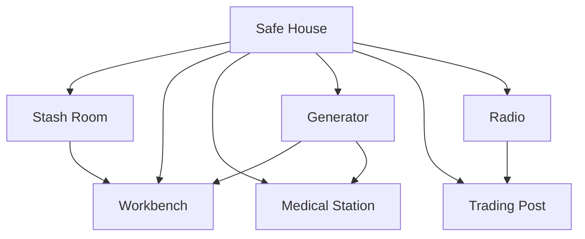

## Overview

The Safe House is the player's persistent out-of-raid base. It gives context to stash growth, crafting, upgrades, insurance claims, and long-term identity.

## Module Dependency

## Functional Areas

| Area | Purpose | Player Action |
| :--- | :--- | :--- |
| Stash Room | Inventory storage and sorting | Store, filter, expand |
| Trophy Vault | Identity and achievement display | View trophies, inspect milestones |
| Workbench | Crafting and repairs | Build, modify, repair |
| Radio | Faction contact and event briefing | Accept tasks, hear world updates |
| Trading Post | Traders and insurance inbox | Buy, sell, claim returns |
| Operator Lounge | Home screen context | Select operator, view status |

## Upgrade Rules

| Rule | Requirement |
| :--- | :--- |
| Clear benefit | Every module upgrade must state what changes |
| Economy sink | Upgrades consume credits, items, or reputation |
| No paid-only power | Upgrade materials must be earnable |
| Readable dependency | Locked modules show prerequisite path |
| Seasonal policy | Wipe behavior must be explicit before season launch |

## Out-Of-Raid Operator State

| State | Purpose | Notes |
| :--- | :--- | :--- |
| Health | Recovery pacing | Avoid excessive downtime |
| Energy / hydration | Light planning pressure | Optional depending on hardcore tuning |
| Cooldown | Prevent instant reuse after severe failure | Should not block all play |
| Morale / readiness | Future flavor system | Cosmetic or narrative first |

## Cross-References

| Topic | Page |
| :--- | :--- |
| Economy sinks | [Economy](economy.html) |
| Insurance inbox | [Insurance System](insurancesystem.html) |
| Home Screen relation | [Home Screen & Lobby](homescreen_design.html) |
| Progression unlocks | [Progression](progression.html) |
