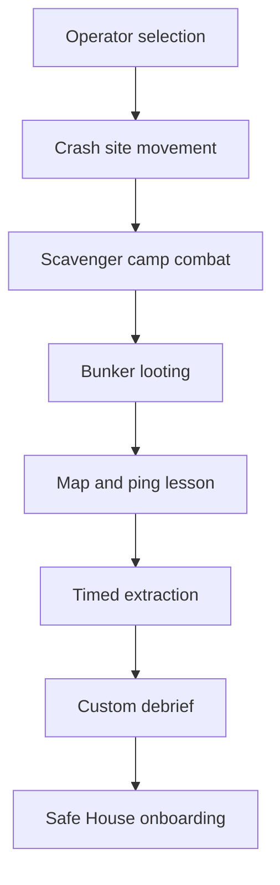

## Overview

Operation Zero is the first guided raid. It teaches extraction fundamentals through a controlled mission rather than a menu tutorial.

## Tutorial Goals

| Goal | Player Learns |
| :--- | :--- |
| Move and camera | How to navigate top-down spaces |
| Loot | Why items matter and how inventory works |
| Combat | Cover, aim, abilities, and damage feedback |
| Map and pings | How to read objectives and extraction markers |
| Extraction | Why leaving alive matters |
| Debrief | How rewards, loss, stash, and next steps work |

## Mission Flow

## Phase Table

| Phase | Teaches | Failure Policy |
| :--- | :--- | :--- |
| Operator Selection | Class identity and ability preview | Cannot fail |
| Crash Site | Movement, camera, objective marker | Soft reset |
| Scavenger Camp | Combat, cover, ability use | Retry checkpoint |
| Bunker | Looting, inventory, item value | Guided prompts |
| Map & Pings | Minimap, waypoint, squad signal | Repeat prompt |
| Extraction | Timer, danger, reward | Retry checkpoint |

## Starter Kit

| Item | Purpose |
| :--- | :--- |
| Basic weapon | Enables first real raid |
| Light armor | Reduces early frustration |
| Medkit | Teaches recovery |
| Small backpack | Teaches loot capacity |
| Credits | Lets player buy a small upgrade |

## Anti-Frustration Rules

| Rule | Reason |
| :--- | :--- |
| No permanent loss during tutorial | Avoid first-session punishment |
| Checkpoints after each lesson | Reduces repetition |
| Clear objective marker | Prevents navigation failure |
| Optional reminders | Helps new mobile players |
| Skip option for returning players | Respects experienced players |

## Cross-References

| Topic | Page |
| :--- | :--- |
| Core loop | [Core Gameplay](coregameplay.html) |
| Controls | [Controls](controls.html) |
| Loadout onboarding | [Loadout Preparation](loadoutpreparation.html) |
| Safe House | [Safe House Design](safe_house_design.html) |
| Accessibility | [Accessibility](accessibility.html) |
