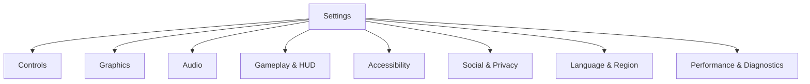
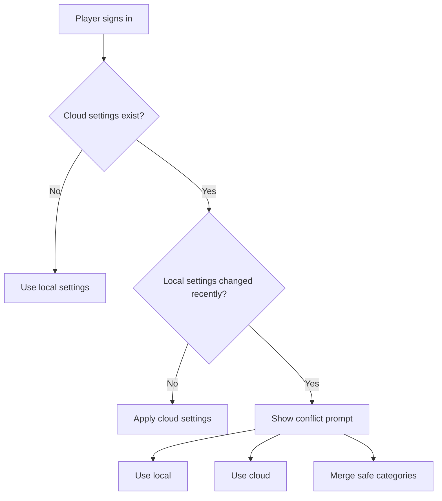

## Overview

User Settings defines how players configure controls, video, audio, gameplay, accessibility, privacy, and diagnostics. This page is the UX and policy hub. The full option list lives in [Settings Matrix](usersettings_matrix.html), and technical tags live in [Settings Tags](usersettings_tags.html).

## Settings Category Hierarchy

## Design Principles

| Principle | Rule |
| :--- | :--- |
| Fast to scan | Categories must be predictable and searchable |
| Safe to change | Risky changes need confirmation or preview |
| Platform-aware | Hide or disable settings that do not apply |
| Competitive integrity | Ranked-locked settings must be explained |
| Accessibility-first | Accessibility settings must be easy to find |
| Cloud-friendly | Sync settings when useful, keep device-specific overrides local |

## Category Summary

| Category | Owns | Detail |
| :--- | :--- | :--- |
| Controls | Input device, sensitivity, remap, gyro, aim assist | [Controls](controls.html) |
| Graphics | Display, quality, post-processing, performance profile | [Settings Matrix](usersettings_matrix.html) |
| Audio | Volumes, output device, voice chat, subtitles | [Communication](communication.html) |
| Gameplay & HUD | Reticle, minimap, hit feedback, loot prompts | [Navigation & Map](navigationandmap.html) |
| Accessibility | Color, motion, timing, input assist, text size | [Accessibility](accessibility.html) |
| Social & Privacy | Invites, presence, chat, matchmaking privacy | [Player Profile](playerprofile.html) |
| Language & Region | Text, audio, region, units, date format | [Localization](localization.html) |
| Diagnostics | FPS, network, telemetry, crash reporting | Technical systems |

## Presets

| Preset | Target Player | Changes |
| :--- | :--- | :--- |
| Competitive | Ranked and serious play | Lower visual noise, stronger performance display, minimal motion |
| Immersive | Narrative and atmosphere | Richer audio/visuals, reduced HUD clutter |
| Battery Saver | Mobile and laptop | Lower FPS target, reduced effects, lower brightness prompts |
| Accessibility Starter | Players needing quick support | Larger text, reduced motion, stronger contrast, hold alternatives |
| Streamer | Content creators | Privacy protection, hide names, reduce notification leakage |

## Cloud Sync And Conflict Flow

## Competitive Integrity Locks

| Setting Type | Ranked Rule |
| :--- | :--- |
| Visual clarity assists | Allowed if accessibility-safe and non-exploitative |
| FOV / zoom | Restricted if it changes information advantage |
| Macros | Disabled |
| Debug overlays | Disabled |
| Input remap | Allowed |
| Aim assist | Platform and mode tuned |

## Cross-References

| Topic | Page |
| :--- | :--- |
| Full option table | [Settings Matrix](usersettings_matrix.html) |
| Technical tags | [Settings Tags](usersettings_tags.html) |
| Controls | [Controls](controls.html) |
| Accessibility | [Accessibility](accessibility.html) |
| Localization | [Localization](localization.html) |
