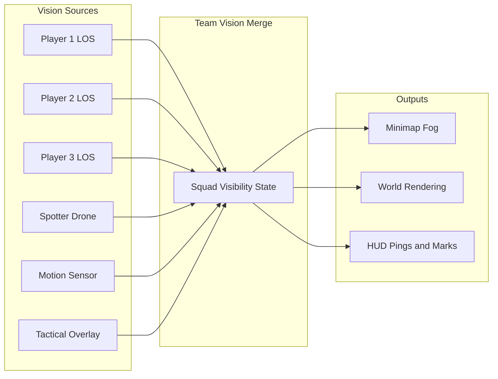

# LOS, Fog of War & Visibility (Shared Team Vision)

### Overview

This document defines the **Line of Sight (LOS)**, **Fog of War**, and **Visibility** systems for the multiplayer hero shooter top-down extraction game. A core pillar is **shared team vision**: any information one squad member sees (or gains via abilities) is shared with the whole team for minimap fog, pings, and enemy/loot awareness. The system supports tactical tension (explored-but-unseen areas), fair combat (enemies only revealed when in LOS or via counterable abilities), and operator identity (Scout/Specialist intel, smoke blockers).

> **Cross-References:** [Core Gameplay Loop](CoreLoop.md) (Information Gathering, infiltration phase), [Hero Abilities](Hero_Abilities.md) (drone, overlay, smoke), [Extraction Mechanics](Extraction_Mechanics.md) (extraction notifications), [Design Pillars](https://github.com/oaiba/ExtractionDocument/blob/main/content/ProjectScope/design-pillars-enhanced.md) (enemy visibility must be fair).

***

### System Architecture

Vision is produced by multiple **sources** (each player's LOS, plus ability-based viewers). These feed into a **team vision merge** that drives minimap fog, world rendering, and HUD pings/marks.

| Concept            | Description                                                                                                                               |
| ------------------ | ----------------------------------------------------------------------------------------------------------------------------------------- |
| **Vision sources** | Each player has personal LOS; abilities (Spotter Drone, Motion Sensor, Tactical Overlay) add vision proxies that contribute to the squad. |
| **Team merge**     | Server-authoritative merge of all sources into a per-tile or per-region squad visibility state.                                           |
| **Outputs**        | Minimap (fog layers, icons), world (what to render where), HUD (pings, "Enemy spotted," marks).                                           |

***

### Visibility Layers (Fog of War)

The game uses layered visibility to create exploration tension and tactical uncertainty. Two options are supported: **2-layer** (Fog + Revealed) for a cleaner, always-readable map, or **3-layer** (add Shroud) for stronger exploration payoff.

| Layer          | Name        | Description                                                                              | Minimap / World Display                                                                                                             | Design Note                                                     |
| -------------- | ----------- | ---------------------------------------------------------------------------------------- | ----------------------------------------------------------------------------------------------------------------------------------- | --------------------------------------------------------------- |
| **Unexplored** | Shroud      | No squad member has ever been in this area.                                              | Dark or hidden; terrain may show as silhouette if world map is unlocked.                                                            | Optional: omit for simpler UX and less "black screen."          |
| **Explored**   | Fog         | Area was seen by at least one teammate at some point; currently not in any viewer's LOS. | Grey/muted; terrain and structures show "last known" state; **enemies/players are not shown** (only last-known position if marked). | Creates tension: "I know the room exists but not who is there." |
| **Revealed**   | Full vision | Area is currently within LOS of at least one teammate or ability (drone, overlay).       | Full detail: enemies, loot, allies, objects.                                                                                        | Foundation for shared team vision.                              |

**Recommendation:** Use **Fog + Revealed** (no Shroud) if the design goal is an always-readable map and lower frustration; use **Shroud + Fog + Revealed** if exploration and "first contact" with areas should feel more meaningful.

***

### Line of Sight (LOS) — Core Rules

#### Definition

A point **B** is "in LOS" of viewer **A** if there exists an unobstructed ray from A's position to B. Obstructions include:

| Blocker Type          | Examples                                                                    |
| --------------------- | --------------------------------------------------------------------------- |
| **Blocking geometry** | Walls, closed doors, solid terrain (top-down: 2D hitbox or blocking tiles). |
| **Vision blockers**   | Smoke (e.g. Obsidian), deployable cover (directional if applicable).        |

#### Range and Top-Down Implementation

| Property         | Value / Method                                                                                                                                           |
| ---------------- | -------------------------------------------------------------------------------------------------------------------------------------------------------- |
| **Sight range**  | Per viewer (e.g. 40–60 m for players; 25 m for Spotter Drone). Beyond range = not visible.                                                               |
| **Top-down LOS** | Raycast 2D or tile-based from viewer; typically 360° vision cone for top-down (or restricted cone if facing matters).                                    |
| **Fairness**     | Enemies are only revealed when genuinely in LOS and in range; no wallhack. Abilities that reveal (Tactical Overlay, drone) have telegraphs and counters. |

#### Integration with Operator Abilities

| Ability                                 | Type              | Range/Radius      | Fog clearing?   | Shared to squad? | Through walls?                 | Counterplay                            |
| --------------------------------------- | ----------------- | ----------------- | --------------- | ---------------- | ------------------------------ | -------------------------------------- |
| Spotter Drone (Hawk)                    | Vision proxy      | 25 m              | Yes (drone LOS) | Yes              | No (drone LOS only)            | Shoot drone (30 HP)                    |
| Motion Sensor (Hawk)                    | Intel             | 10 m              | No (ping only)  | Yes              | N/A (motion)                   | Crouch/prone; destroy (15 HP)          |
| Tactical Overlay (Glitch)               | Vision proxy      | 40 m              | Yes             | Yes              | No (last-known in cover)       | Kill Glitch; hard cover                |
| Smoke Grenade (Mamba / future operator) | Blocker           | 8 m radius        | No              | N/A              | N/A (blocks all through smoke) | Avoid smoke area; wait for dissipation |
| Flashbang (Mamba)                       | Vision denial     | 5 m               | No              | No               | No                             | Look away; cover                       |
| Deployable Cover (Bastion)              | LOS blocker       | N/A (directional) | No              | N/A              | One direction                  | Flank; destroy (300 HP)                |
| Tech Savvy (Glitch)                     | Exception (traps) | 8 m               | No              | No (self)        | Yes (traps only)               | N/A                                    |
| Ghost Cloak (Hawk)                      | Self-conceal      | 8 m shimmer       | No              | No               | N/A                            | Shimmer visible 8 m; damage breaks     |

See [Hero Abilities](Hero_Abilities.md) for full specs and the "Interaction with LOS/Visibility" section in that doc.

#### Passives and Minor Effects

These passives do not create vision proxies or clear fog, but they affect how visibility and detection work:

| Passive                 | Effect on LOS/Visibility                                                                                         |
| ----------------------- | ---------------------------------------------------------------------------------------------------------------- |
| **Light Step (Hawk)**   | Reduces footstep audible range; does not change LOS or fog, but reduces the chance enemies locate Hawk by sound. |
| **Tech Savvy (Glitch)** | Reveals trap devices (Motion Sensors, mines) within 8 m through walls (UI highlight); does not reveal players.   |
| **Ghost Cloak (Hawk)**  | Reduces Hawk's visibility to enemies (shimmer within 8 m); does not provide intel to squad.                      |

***

### Shared Team Vision

#### Principle

Any information **one** squad member sees (in their LOS or via an ability) is treated as **seen by the whole squad** for:

* **Minimap:** Fog is cleared for the team in any area at least one teammate currently sees.
* **Enemy / loot / objects:** If in LOS of any teammate (or revealed by ability), they can be shown on HUD/minimap for the whole team according to mark/ping rules.

#### Player-Facing Behavior

| Element         | Behavior                                                                                                                                                              |
| --------------- | --------------------------------------------------------------------------------------------------------------------------------------------------------------------- |
| **Camera**      | Each player keeps their own top-down camera; no requirement to "see through teammate eyes."                                                                           |
| **Minimap**     | Uses **merged** squad vision: explored + revealed areas; teammate positions; pings/marks; enemies when revealed or marked.                                            |
| **World view**  | Rendered from local viewport only. Optional future: picture-in-picture or teammate view.                                                                              |
| **Ping / mark** | Teammates can mark locations (enemy, loot, extract, danger). Marks persist in explored/fog as "last known" (e.g. Glitch overlay last-known when enemy goes to cover). |

#### Alignment with Design Pillars and Core Loop

* **Information Gathering** (Core Loop): Visual spotting = line of sight; "Information is more valuable than firepower." LOS and shared vision support the Scout fantasy: "Information is ammunition."
* **Awareness cues:** Ping, quick chat, and sound-to-HUD (e.g. directional gunfire, footsteps) complement shared vision for team situational awareness.

***

### Minimap and HUD

#### Minimap

| Feature   | Specification                                                                                                                                                                                            |
| --------- | -------------------------------------------------------------------------------------------------------------------------------------------------------------------------------------------------------- |
| **Fog**   | Two states (Explored / Revealed) or three (add Unexplored/Shroud) as chosen above.                                                                                                                       |
| **Icons** | Teammates (always for squad), extraction zones (when known), pings/marks from teammates, enemies when revealed (drone/overlay) or when in LOS (balance: can restrict to mark-only to avoid over-reveal). |

#### HUD

* **Pings** and **"Enemy spotted"** callouts from teammates.
* **Sound cues** (gunshot direction, footsteps) mapped to compass or HUD as in Extraction and design pillars.

#### Cross-Platform

Visibility state, fog layers, and squad-merged vision data are identical on PC, console, and mobile. Minimap and HUD show the same information; layout and size may adapt per platform (see [User Interface](https://github.com/oaiba/ExtractionDocument/blob/main/content/Visuals/UserInterface.md)). Ping/mark input may differ (e.g. radial menu vs keybind); server-authoritative visibility ensures parity. See [Controls](https://github.com/oaiba/ExtractionDocument/blob/main/content/GameDesign/Controls.md) for input by platform.

***

### Abilities and Environmental Modifiers

#### Abilities as Vision Proxies

Spotter Drone (Hawk), Motion Sensor (Hawk), and Tactical Overlay (Glitch) add vision or intel into the **Squad Vision Merge**. Rules:

* Each ability "sees" only within its spec (range, LOS, "not through walls" for Overlay).
* Counters remain: shoot drone, destroy sensor, kill Glitch to end overlay.

#### Environment

| Modifier                        | Effect                                                                                                                  |
| ------------------------------- | ----------------------------------------------------------------------------------------------------------------------- |
| **Weather (fog, rain)**         | Can reduce sight range and/or audio range (e.g. "fog reduces sightlines," "rain muffles footsteps" per design pillars). |
| **Green Fog (chemical hazard)** | Reduced visibility; applies to all viewers (players and abilities as defined).                                          |

See [Environmental Hazards](Environmental_Hazards.md) for full hazard and weather specs.

***

### Implementation Notes (Technical GDD Reference)

These points are for downstream technical design and implementation.

| Topic           | Guideline                                                                                                                                                                                         |
| --------------- | ------------------------------------------------------------------------------------------------------------------------------------------------------------------------------------------------- |
| **Authority**   | Visibility state should be **server-authoritative** to prevent clients from enabling "see all."                                                                                                   |
| **Performance** | Tile/cell-based (e.g. 1–2 m grid); update on unit cell-boundary cross rather than every frame (RTS-style fog optimization). Use raycast only when needed (e.g. to resolve if an enemy is in LOS). |
| **Data**        | Per tile/cell: `explored` (bool), `currently_revealed` (bool or team bitmask), optional `last_seen_enemy_position` + timestamp for last-known display.                                            |

***

### Summary of Key Decisions

| Topic             | Decision                                                                                                  |
| ----------------- | --------------------------------------------------------------------------------------------------------- |
| **Fog layers**    | 2 (Fog + Revealed) or 3 (+ Shroud) depending on exploration emphasis.                                     |
| **Shared vision** | Merge LOS and ability-derived vision for the whole squad; minimap and intel (mark/ping) use merged state. |
| **LOS**           | Raycast 2D/tile; blocking = walls, doors, smoke; per-viewer sight range.                                  |
| **Fairness**      | Enemies revealed only when in valid LOS/range or by abilities with counterplay.                           |
| **Abilities**     | Hawk/Glitch/Obsidian integrate as vision proxies or blockers (drone, sensor, overlay, smoke).             |
| **Authority**     | Server-authoritative visibility for anti-cheat.                                                           |

***

### Cross-References

* [Core Gameplay Loop](CoreLoop.md) — Phase 2 Information Gathering, squad shared vision and minimap fog.
* [Hero Abilities](Hero_Abilities.md) — Operator specs and Interaction with LOS/Visibility.
* [Extraction Mechanics](Extraction_Mechanics.md) — Extraction notifications and information asymmetry.
* [Environmental Hazards](Environmental_Hazards.md) — Weather and hazard effects on visibility.
* [Design Pillars](https://github.com/oaiba/ExtractionDocument/blob/main/content/ProjectScope/design-pillars-enhanced.md) — Fair visibility, no unclear threats.
