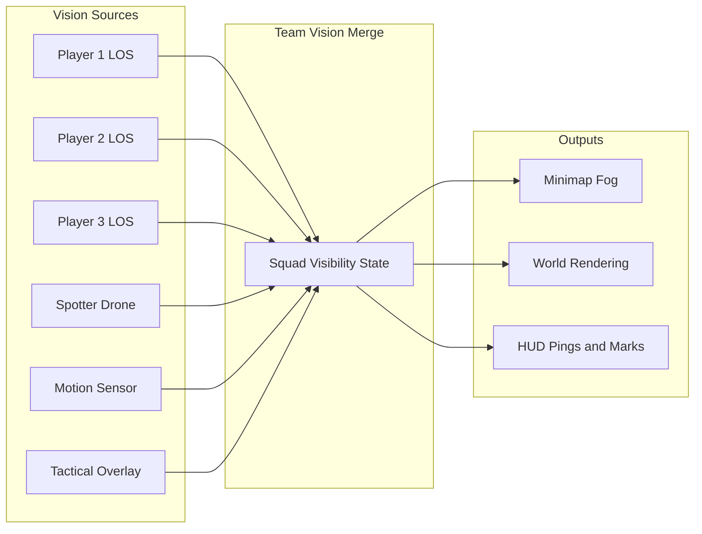

### Tổng Quan

Tài liệu này định nghĩa the **Line of Sight (LOS)**, **Fog of War**, và **Visibility** hệ thống for the multiplayer hero shooter top-down extraction game. A cốt lõi pillar is **shared team vision**: any information one squad member sees (hoặc gains via abilities) is shared với the whole team for minimap fog, pings, và địch/loot awareness. The hệ thống supports tactical tension (explored-nhưng-unseen areas), fair combat (địch only revealed khi in LOS hoặc via counterable abilities), và operator identity (Scout/Specialist intel, smoke blockers).

> **Cross-References:** [cốt lõi Gameplay Loop](coreloop/index.html) (Information Gathering, infiltration phase), [Hero Abilities](hero_abilities/index.html) (drone, overlay, smoke), [Extraction cơ chế](extraction_mechanics/index.html) (extraction notifications), [Design Pillars](https://github.com/oaiba/ExtractionDocument/blob/main/content/ProjectScope/design-pillars-enhanced.md) (địch visibility phải được fair).

***

### hệ thống Architecture

Vision is produced by multiple **sources** (each người chơi's LOS, plus ability-based viewers). These feed into a **team vision merge** that drives minimap fog, world rendering, và HUD pings/marks.

| Concept            | Description                                                                                                                               |
| ------------------ | ----------------------------------------------------------------------------------------------------------------------------------------- |
| **Vision sources** | Each người chơi has personal LOS; abilities (Spotter Drone, Motion Sensor, Tactical Overlay) add vision proxies that contribute to the squad. |
| **Team merge**     | Server-authoritative merge of all sources into a per-tile hoặc per-region squad visibility trạng thái.                                           |
| **Outputs**        | Minimap (fog layers, icons), world (what to render where), HUD (pings, "địch spotted," marks).                                           |

***

### Visibility Layers (Fog of War)

The game uses layered visibility to tạo exploration tension và tactical uncertainty. Two options are supported: **2-layer** (Fog + Revealed) for a cleaner, always-dễ đọc map, hoặc **3-layer** (add Shroud) for stronger exploration payoff.

| Layer          | Name        | Description                                                                              | Minimap / World Display                                                                                                             | Design Note                                                     |
| -------------- | ----------- | ---------------------------------------------------------------------------------------- | ----------------------------------------------------------------------------------------------------------------------------------- | --------------------------------------------------------------- |
| **Unexplored** | Shroud      | No squad member has ever been in this area.                                              | Dark hoặc hidden; terrain may show as silhouette nếu world map is unlocked.                                                            | Optional: omit for simpler UX và less "black màn hình."          |
| **Explored**   | Fog         | Area was seen by at least one teammate at some point; currently not in any viewer's LOS. | Grey/muted; terrain và structures show "last known" trạng thái; **địch/người chơi are not shown** (only last-known position nếu marked). | tạo tension: "I know the room exists nhưng not who is there." |
| **Revealed**   | Full vision | Area is currently within LOS of at least one teammate hoặc ability (drone, overlay).       | Full chi tiết: địch, loot, allies, objects.                                                                                        | Foundation for shared team vision.                              |

**Recommendation:** cách dùng **Fog + Revealed** (no Shroud) nếu the design mục tiêu is an always-dễ đọc map và lower frustration; cách dùng **Shroud + Fog + Revealed** nếu exploration và "first contact" với areas should feel more meaningful.

***

### Line of Sight (LOS) — cốt lõi Rules

#### định nghĩa

A point **B** is "in LOS" of viewer **A** nếu there exists an unobstructed ray from A's position to B. Obstructions include:

| Blocker Type          | Examples                                                                    |
| --------------------- | --------------------------------------------------------------------------- |
| **Blocking geometry** | Walls, closed doors, solid terrain (top-down: 2D hitbox hoặc blocking tiles). |
| **Vision blockers**   | Smoke (e.g. Obsidian), deployable cover (directional nếu applicable).        |

#### Range và Top-Down Implementation

| Property         | giá trị / Method                                                                                                                                           |
| ---------------- | -------------------------------------------------------------------------------------------------------------------------------------------------------- |
| **Sight range**  | Per viewer (e.g. 40–60 m for người chơi; 25 m for Spotter Drone). Beyond range = not hiển thị rõ.                                                               |
| **Top-down LOS** | Raycast 2D hoặc tile-based from viewer; typically 360° vision cone for top-down (hoặc restricted cone nếu facing matters).                                    |
| **Fairness**     | địch are only revealed khi genuinely in LOS và in range; no wallhack. Abilities that reveal (Tactical Overlay, drone) have telegraphs và counters. |

#### Integration với Operator Abilities

| Ability                                 | Type              | Range/Radius      | Fog clearing?   | shared to squad? | thông qua walls?                 | Counterplay                            |
| --------------------------------------- | ----------------- | ----------------- | --------------- | ---------------- | ------------------------------ | -------------------------------------- |
| Spotter Drone (Hawk)                    | Vision proxy      | 25 m              | Yes (drone LOS) | Yes              | No (drone LOS only)            | Shoot drone (30 HP)                    |
| Motion Sensor (Hawk)                    | Intel             | 10 m              | No (ping only)  | Yes              | N/A (motion)                   | Crouch/prone; destroy (15 HP)          |
| Tactical Overlay (Glitch)               | Vision proxy      | 40 m              | Yes             | Yes              | No (last-known in cover)       | Kill Glitch; hard cover                |
| Smoke Grenade (Mamba / future operator) | Blocker           | 8 m radius        | No              | N/A              | N/A (blocks all thông qua smoke) | Avoid smoke area; wait for dissipation |
| Flashbang (Mamba)                       | Vision denial     | 5 m               | No              | No               | No                             | Look away; cover                       |
| Deployable Cover (Bastion)              | LOS blocker       | N/A (directional) | No              | N/A              | One direction                  | Flank; destroy (300 HP)                |
| Tech Savvy (Glitch)                     | Exception (traps) | 8 m               | No              | No (self)        | Yes (traps only)               | N/A                                    |
| Ghost Cloak (Hawk)                      | Self-conceal      | 8 m shimmer       | No              | No               | N/A                            | Shimmer hiển thị rõ 8 m; damage breaks     |

Xem [Hero Abilities](hero_abilities/index.html) for full specs và the "Interaction với LOS/Visibility" section in that doc.

#### Passives và Minor Effects

These passives do not tạo vision proxies hoặc rõ fog, nhưng they affect how visibility và detection work:

| Passive                 | Effect on LOS/Visibility                                                                                         |
| ----------------------- | ---------------------------------------------------------------------------------------------------------------- |
| **Light Step (Hawk)**   | Reduces footstep audible range; does not change LOS hoặc fog, nhưng reduces the chance địch locate Hawk by sound. |
| **Tech Savvy (Glitch)** | Reveals trap devices (Motion Sensors, mines) within 8 m thông qua walls (UI highlight); does not reveal người chơi.   |
| **Ghost Cloak (Hawk)**  | Reduces Hawk's visibility to địch (shimmer within 8 m); does not provide intel to squad.                      |

***

### shared Team Vision

#### Principle

Any information **one** squad member sees (in their LOS hoặc via an ability) is treated as **seen by the whole squad** for:

* **Minimap:** Fog is cleared for the team in any area at least one teammate currently sees.
* **địch / loot / objects:** nếu in LOS of any teammate (hoặc revealed by ability), they can be shown on HUD/minimap for the whole team according to mark/ping rules.

#### người chơi-Facing Behavior

| Element         | Behavior                                                                                                                                                              |
| --------------- | --------------------------------------------------------------------------------------------------------------------------------------------------------------------- |
| **Camera**      | Each người chơi keeps their own top-down camera; no yêu cầu to "see thông qua teammate eyes."                                                                           |
| **Minimap**     | Uses **merged** squad vision: explored + revealed areas; teammate positions; pings/marks; địch khi revealed hoặc marked.                                            |
| **World view**  | Rendered from local viewport only. Optional future: picture-in-picture hoặc teammate view.                                                                              |
| **Ping / mark** | Teammates can mark locations (địch, loot, extract, danger). Marks persist in explored/fog as "last known" (e.g. Glitch overlay last-known khi địch goes to cover). |

#### Alignment với Design Pillars và cốt lõi Loop

* **Information Gathering** (cốt lõi Loop): Visual spotting = line of sight; "Information is more valuable than firepower." LOS và shared vision support the Scout fantasy: "Information is ammunition."
* **Awareness cues:** Ping, quick chat, và sound-to-HUD (e.g. directional gunfire, footsteps) complement shared vision for team situational awareness.

***

### Minimap và HUD

#### Minimap

| tính năng   | Specification                                                                                                                                                                                            |
| --------- | -------------------------------------------------------------------------------------------------------------------------------------------------------------------------------------------------------- |
| **Fog**   | Two trạng thái (Explored / Revealed) hoặc three (add Unexplored/Shroud) as chosen above.                                                                                                                       |
| **Icons** | Teammates (always for squad), extraction zones (khi known), pings/marks from teammates, địch khi revealed (drone/overlay) hoặc khi in LOS (balance: can restrict to mark-only to avoid over-reveal). |

#### HUD

* **Pings** và **"địch spotted"** callouts from teammates.
* **Sound cues** (gunshot direction, footsteps) mapped to compass hoặc HUD as in Extraction và design pillars.

#### Cross-Platform

Visibility trạng thái, fog layers, và squad-merged vision data are identical on PC, console, và mobile. Minimap và HUD show the same information; layout và size may adapt per platform (Xem [User Interface](https://github.com/oaiba/ExtractionDocument/blob/main/content/Visuals/UserInterface.md)). Ping/mark input may differ (e.g. radial menu vs keybind); server-authoritative visibility ensures parity. Xem [Controls](https://github.com/oaiba/ExtractionDocument/blob/main/content/GameDesign/Controls.md) for input by platform.

***

### Abilities và Environmental Modifiers

#### Abilities as Vision Proxies

Spotter Drone (Hawk), Motion Sensor (Hawk), và Tactical Overlay (Glitch) add vision hoặc intel into the **Squad Vision Merge**. Rules:

* Each ability "sees" only within its spec (range, LOS, "not thông qua walls" for Overlay).
* Counters remain: shoot drone, destroy sensor, kill Glitch to end overlay.

#### Environment

| Modifier                        | Effect                                                                                                                  |
| ------------------------------- | ----------------------------------------------------------------------------------------------------------------------- |
| **Weather (fog, rain)**         | Can reduce sight range và/hoặc audio range (e.g. "fog reduces sightlines," "rain muffles footsteps" per design pillars). |
| **Green Fog (chemical hazard)** | Reduced visibility; applies to all viewers (người chơi và abilities as defined).                                          |

Xem [Environmental Hazards](environmental_hazards/index.html) for full hazard và weather specs.

***

### Implementation ghi chú (Technical GDD Reference)

These points are for downstream technical design và implementation.

| Topic           | Guideline                                                                                                                                                                                         |
| --------------- | ------------------------------------------------------------------------------------------------------------------------------------------------------------------------------------------------- |
| **Authority**   | Visibility trạng thái nên được **server-authoritative** to prevent clients from enabling "see all."                                                                                                   |
| **Performance** | Tile/cell-based (e.g. 1–2 m grid); update on unit cell-boundary cross rather than every frame (RTS-style fog optimization). cách dùng raycast only khi needed (e.g. to resolve nếu an địch is in LOS). |
| **Data**        | Per tile/cell: `explored` (bool), `currently_revealed` (bool hoặc team bitmask), optional `last_seen_enemy_position` + timestamp for last-known display.                                            |

***

### Summary of chính quyết định

| Topic             | quyết định                                                                                                  |
| ----------------- | --------------------------------------------------------------------------------------------------------- |
| **Fog layers**    | 2 (Fog + Revealed) hoặc 3 (+ Shroud) depending on exploration emphasis.                                     |
| **shared vision** | Merge LOS và ability-derived vision for the whole squad; minimap và intel (mark/ping) cách dùng merged trạng thái. |
| **LOS**           | Raycast 2D/tile; blocking = walls, doors, smoke; per-viewer sight range.                                  |
| **Fairness**      | địch revealed only khi in valid LOS/range hoặc by abilities với counterplay.                           |
| **Abilities**     | Hawk/Glitch/Obsidian integrate as vision proxies hoặc blockers (drone, sensor, overlay, smoke).             |
| **Authority**     | Server-authoritative visibility for anti-cheat.                                                           |

***

### Tham Chiếu Chéo

* [cốt lõi Gameplay Loop](coreloop/index.html) — Phase 2 Information Gathering, squad shared vision và minimap fog.
* [Hero Abilities](hero_abilities/index.html) — Operator specs và Interaction với LOS/Visibility.
* [Extraction cơ chế](extraction_mechanics/index.html) — Extraction notifications và information asymmetry.
* [Environmental Hazards](environmental_hazards/index.html) — Weather và hazard effects on visibility.
* [Design Pillars](https://github.com/oaiba/ExtractionDocument/blob/main/content/ProjectScope/design-pillars-enhanced.md) — Fair visibility, no unclear threats.
