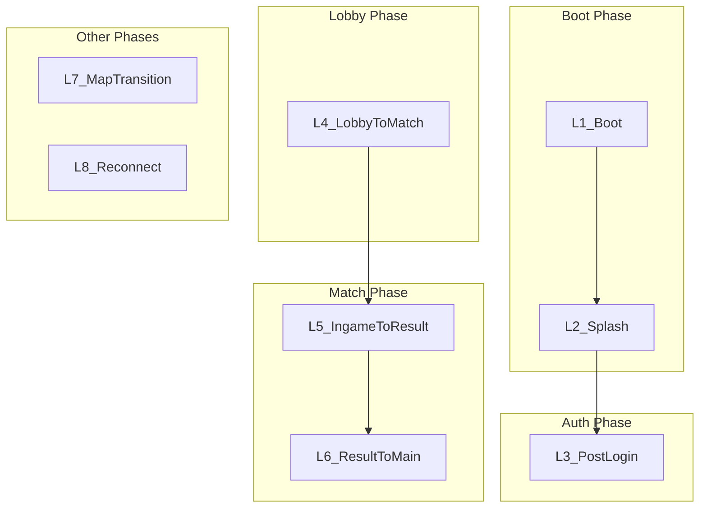

## Overview

The **Async Loading Screen** system provides a unified, context-aware loading experience across all game transitions. Loading screens are not merely technical necessities—they are strategic design tools that shape player mood, manage expectations, and build immersion. This document defines the taxonomy, content specifications, layouts, and technical requirements.

> **Cross-References:** [Matchmaking & Lobby](../Gameplay/Matchmaking_Lobby.md) — L4 loading flow; [Lore Delivery](../../Story/Lore_Delivery.md) — Loading screen tips format; [Loadout Preparation](../../GameDesign/LoadoutPreparation.md) — Loading tip rotation; [Home Screen Design](../../GameDesign/HomeScreen_Design.md) — L3 post-login state.

---

## 1. Design Taxonomy (DiGRA 2023)

Based on Antognoli & Fisher's research on video game loading interfaces:

| Dimension | Description | Application |
| :-------- | :---------- | :---------- |
| **Hypermediacy vs Transparency** | Loading draws attention vs. remains invisible for immersion | Boot/Splash: Hypermediacy. Lobby→Match: Transparency (diegetic) |
| **Diegetic vs Non-diegetic** | Content within game world vs. external UI | Faction tips = diegetic. Progress bar = non-diegetic |
| **Passive vs Interactive** | Static display vs. player engagement | Interactive elements reduce perceived wait time |
| **Pedagogic vs Misdirection** | Educational (tips) vs. entertainment (fun fact, video) | Combine both based on context |

### Best Practices

- **Acceptable threshold:** ~10 seconds; beyond increases frustration
- **Progress indicator:** Always visible (Game Developer Rules)
- **Interactive > Animated > Static:** Reduces perceived wait time
- **No spoilers:** Never show unexplored areas
- **Async loading:** Prevent freeze; defer scene activation until ready

---

## 2. Loading Type Taxonomy

### 2.1 Flow Diagram



### 2.2 Loading Type Specifications

| ID | Code Name | Display Name | Trigger | Est. Duration | Skip Allowed |
| :--| :-------- | :----------- | :------ | :------------ | :----------- |
| **L1** | `LT_Boot` | Boot / Cold Start | App launch (first frame) | 2–5s | No |
| **L2** | `LT_Splash` | Splash Screen | After boot, before auth | 1–3s | Yes (after 1s) |
| **L3** | `LT_PostLogin` | Post-Login to Lobby | After successful login | 3–8s | No |
| **L4** | `LT_LobbyToMatch` | Lobby to In-Raid | Deploy countdown complete | 5–15s | No |
| **L5** | `LT_IngameToResult` | In-Raid to Endgame Result | Extract/Death complete | 2–5s | No |
| **L6** | `LT_ResultToMain` | Result to Main Menu | Continue from AAR | 3–8s | No |
| **L7** | `LT_MapTransition` | Map/Zone Transition | Multi-zone raid (if applicable) | 5–10s | No |
| **L8** | `LT_Reconnect` | Reconnect to Raid | Disconnect recovery | 5–30s | No |

---

## 3. Content Type Specifications

### 3.1 Content Types

| Content Type | Description | Use Cases | Example |
| :----------- | :---------- | :-------- | :------ |
| **Background Image** | Static or animated art by context | All loading types | Map thumbnail, operator render |
| **Widget** | Small UI (progress, squad status) | L4, L6 | Progress bar, squad ready |
| **Text - Tips** | In-character gameplay tips | L3, L4, L6 | "Heavy bags make heavy noise." |
| **Text - Fun Fact** | Light lore, trivia | L3, L4 | "Day 1,247. The radio still plays..." |
| **Text - Intro** | Map/operator introduction | L4 | "Sector 7 — Industrial Decay" |
| **Animation** | Spinner, operator idle | All | Operator breathing, loading spinner |
| **Video Trailer** | Short video (season, map) | L3 (optional), L4 | Seasonal trailer, map flythrough |

### 3.2 Content → Loading Type Mapping

| Loading Type | Background | Widget | Tips | Fun Fact | Intro | Animation | Video |
| :----------- | :--------- | :----- | :--- | :------- | :---- | :-------- | :---- |
| L1_Boot | Logo | — | — | — | — | Spinner | — |
| L2_Splash | Dev logo | — | — | — | — | Fade | — |
| L3_PostLogin | Operator/env | Progress | Yes | Yes | — | Operator idle | Optional |
| L4_LobbyToMatch | Map art | Progress, Squad | Yes | Yes | Map name | — | Optional |
| L5_IngameToResult | Blur game | Progress | — | — | — | Fade | — |
| L6_ResultToMain | Dark gradient | Progress | Yes | Yes | — | — | — |
| L7_MapTransition | Zone art | Progress | Yes | Yes | Zone name | — | Optional |
| L8_Reconnect | Dark | Progress | — | — | — | Spinner | — |

---

## 4. Per-Loading-Type Layouts

### 4.1 L1_Boot

```
+------------------------------------------------------------------+
|                                                                  |
|                                                                  |
|                    [GAME LOGO - CENTERED]                        |
|                                                                  |
|                    [========== 45% ==========]                   |
|                         Loading...                               |
|                                                                  |
|                                                                  |
+------------------------------------------------------------------+
```

- **Background:** Solid dark (#0D0D0D)
- **Content:** Logo only, progress bar
- **Animation:** Subtle pulse on logo

### 4.2 L2_Splash

```
+------------------------------------------------------------------+
|                                                                  |
|              [PUBLISHER / DEV STUDIO LOGO]                        |
|                                                                  |
|                    Press any key to skip                         |
|                                                                  |
+------------------------------------------------------------------+
```

- **Background:** Brand gradient
- **Skip:** Available after 1 second

### 4.3 L3_PostLogin

```
+------------------------------------------------------------------+
|  [OPERATOR SHOWCASE - LEFT 1/3]     |  [CONTENT PANEL - RIGHT 2/3] |
|                                    |                              |
|  [3D Operator - Idle animation]    |  "Heavy bags make heavy      |
|  Background: Staging environment   |   noise. The Zone punishes   |
|                                    |   greed."                     |
|                                    |  — Salvage Corps field manual |
|                                    |                              |
|                                    |  [ ◀ Previous  |  Next ▶ ]   |
|                                    |                              |
|                                    |  [========== 72% ==========]  |
|                                    |  Preparing your Safe House...   |
+------------------------------------------------------------------+
```

- **Background:** Operator + staging environment (per [HomeScreen_Design](../../GameDesign/HomeScreen_Design.md))
- **Tips:** Rotate every 8s; manual paging allowed
- **Optional:** Seasonal video trailer (muted, loop)

### 4.4 L4_LobbyToMatch

```
+------------------------------------------------------------------+
|  [MAP ART - FULL BLEED BACKGROUND]                               |
|                                                                  |
|  SECTOR 7 — INDUSTRIAL DECAY                                      |
|  Difficulty: Hard  |  Players: 16  |  Night                       |
|                                                                  |
|  +------------------------------------------------------------+  |
|  | "AI Scavs patrol in groups. Shoot one, alert all."         |  |
|  | — Underground survival guide                                |  |
|  | [ ◀ Previous  |  Next ▶ ]                                   |  |
|  +------------------------------------------------------------+  |
|                                                                  |
|  SQUAD: ● Kai_Virtanen [Ready]  ● Dxt_Raptor [Ready]             |
|                                                                  |
|  [============== 85% ==============]  Deploying...               |
+------------------------------------------------------------------+
```

- **Background:** Map-specific artwork (no spoilers for locked maps)
- **Widgets:** Progress bar, squad status
- **Tips:** Tactical, economy, exploration, operator-specific
- **Optional:** Map flythrough video

### 4.5 L5_IngameToResult

```
+------------------------------------------------------------------+
|  [BLURRED GAME FRAME - 80% opacity]                              |
|                                                                  |
|                    [========== 90% ==========]                   |
|                    Calculating results...                        |
|                                                                  |
+------------------------------------------------------------------+
```

- **Background:** Blurred last game frame
- **Minimal:** Progress only; no tips (quick transition)

### 4.6 L6_ResultToMain

```
+------------------------------------------------------------------+
|  [DARK GRADIENT BACKGROUND]                                      |
|                                                                  |
|  "Every Contractor starts as a stranger. Every stranger is a     |
|   threat until proven otherwise."                                 |
|  — Peacekeeper orientation manual                               |
|                                                                  |
|  [ ◀ Previous  |  Next ▶ ]                                       |
|                                                                  |
|  [============== 60% ==============]  Returning to Safe House...     |
+------------------------------------------------------------------+
```

- **Background:** Dark gradient (matches AAR theme)
- **Tips:** Lore, faction philosophy, fun facts

### 4.7 L8_Reconnect

```
+------------------------------------------------------------------+
|                                                                  |
|                    RECONNECTING TO RAID                          |
|                                                                  |
|                    [========== 40% ==========]                   |
|                    Re-establishing connection...                 |
|                                                                  |
|                    [ CANCEL ]                                    |
+------------------------------------------------------------------+
```

- **Background:** Dark, minimal
- **Cancel:** Returns to main menu (gear lost per [Extraction Mechanics](../Gameplay/Extraction_Mechanics.md))

---

## 5. Async Loading Technical Requirements

### 5.1 Architecture

```
LoadingManager (Singleton)
├── LoadingType (enum: L1..L8)
├── ContentProvider (tips, fun facts, images, video)
├── AsyncSceneLoader (SceneManager / LevelStreaming)
└── LoadingScreenWidget (UI)
    ├── BackgroundLayer (Image/Video)
    ├── ContentLayer (Text, Widgets)
    └── ProgressLayer (Slider, Percentage)
```

### 5.2 Async Loading Flow

1. Set `allowSceneActivation = false` — Load scene asynchronously
2. Display Loading Screen immediately
3. Loop: `while (progress < 0.9f)` — Update progress bar, rotate tips
4. Fade out loading screen (300ms)
5. Set `allowSceneActivation = true`
6. Fade in target scene (300ms)

### 5.3 Freeze Prevention

- **Defer heavy logic:** Move complex `Awake()`/`Start()` to coroutines across frames
- **Shader pre-warm:** Compile shaders during splash (L2)
- **Asset streaming:** Load critical assets first, optional later
- **Minimum display time:** Configurable per loading type to avoid flicker

---

## 6. Platform Differences

| Aspect | PC | Console | Mobile |
| :----- | :--| :------ | :----- |
| **Video playback** | Full quality | Full quality | Optional (battery) |
| **Tip font size** | 14px | 18px | 16px |
| **Progress style** | Bar + % | Bar + % | Bar only (space) |
| **Skip L2** | Any key | Any button | Tap |
| **Operator L3** | LOD2 3D | LOD2 3D | Static image (low-end) |
| **Touch paging** | N/A | N/A | Swipe left/right for tips |

---

## 7. Data References

- **LoadingTip / LoadingContent:** See [Loading Screen Data Schema](../../GDD_Technical/Data/LoadingScreen_DataSchema.md)
- **LoadingScreenConfig:** Per-loading-type configuration (min display time, asset pools, etc.)

---

## 8. Cross-References

- [Matchmaking & Lobby](../Gameplay/Matchmaking_Lobby.md) — L4 loading in deploy flow
- [Lore Delivery](../../Story/Lore_Delivery.md) — Loading screen tip format and attribution
- [Loadout Preparation](../../GameDesign/LoadoutPreparation.md) — Loading tip rotation (8s)
- [Home Screen Design](../../GameDesign/HomeScreen_Design.md) — L3 operator showcase, loading state
- [UI System](../../GDD_Technical/Systems/UISystem.md) — ScreenType enum for loading phases
- [UX Flows](UX_Flows.md) — Player journey with loading nodes
