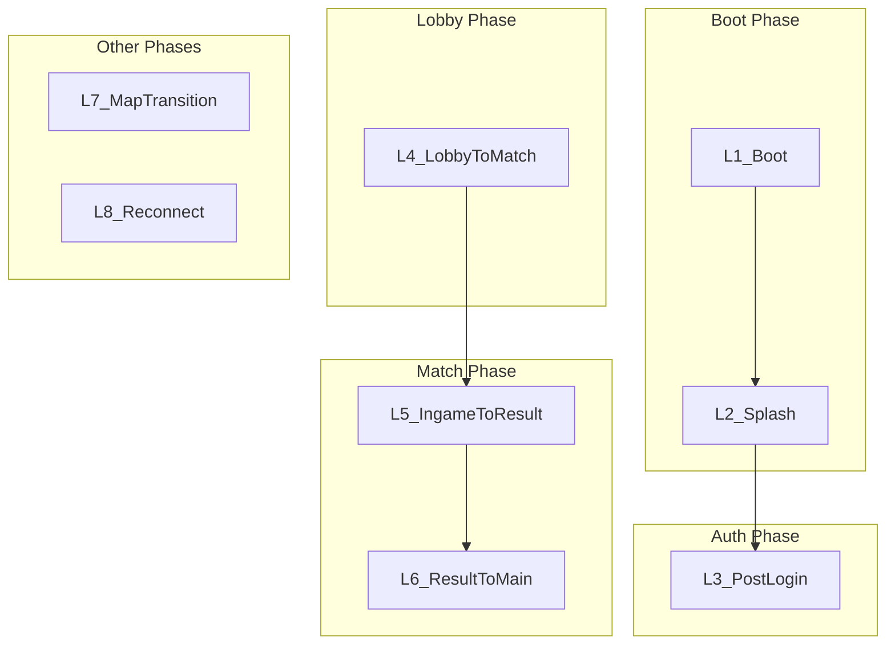

### Tổng Quan

The **Async loading màn hình** hệ thống provides a unified, context-aware loading trải nghiệm across all game transitions. loading màn hình are not merely technical necessities—they are strategic design tools that shape người chơi mood, manage expectations, và build immersion. Tài liệu này định nghĩa the taxonomy, content specifications, layouts, và technical yêu cầu.

> **Cross-References:** [Matchmaking & Lobby](../gameplay/matchmaking_lobby/index.html) — L4 loading flow; [Lore Delivery](https://github.com/oaiba/ExtractionDocument/blob/main/content/Story/Lore_Delivery.md) — loading màn hình tips format; [Loadout Preparation](https://github.com/oaiba/ExtractionDocument/blob/main/content/GameDesign/LoadoutPreparation.md) — loading tip rotation; [Home màn hình Design](https://github.com/oaiba/ExtractionDocument/blob/main/content/GameDesign/HomeScreen_Design.md) — L3 post-login trạng thái.

***

## Điều Hướng Nhanh

| điểm đến | cách dùng |
| :--- | :--- |
| [UI/UX Index](_index/index.html) | Full UI/UX documentation hub |
| [màn hình Groups Overview](screen_groups_overview/index.html) | Lifecycle taxonomy và designer-ready spec template |
| [global UX Standards](global_ux_standards/index.html) | shared navigation, focus, trạng thái, modal, và accessibility rules |
| [Settings & hệ thống màn hình](commerce_settings_system_screens/index.html) | Boot, splash, login, version mismatch, diagnostics |
| [Pre-Raid màn hình](pre_raid_screens/index.html) | Lobby-to-match và matchmaking transition context |
| [Post-Raid màn hình](post_raid_screens/index.html) | kết quả-to-main và post-raid transition context |

***

### 1. Design Taxonomy (DiGRA 2023)

Based on Antognoli & Fisher's research on video game loading interfaces:

| Dimension                        | Description                                                 | Application                                                     |
| -------------------------------- | ----------------------------------------------------------- | --------------------------------------------------------------- |
| **Hypermediacy vs Transparency** | loading draws attention vs. remains invisible for immersion | Boot/Splash: Hypermediacy. Lobby→Match: Transparency (diegetic) |
| **Diegetic vs Non-diegetic**     | Content within game world vs. external UI                   | Faction tips = diegetic. Progress bar = non-diegetic            |
| **Passive vs Interactive**       | Static display vs. người chơi engagement                        | Interactive elements reduce perceived wait thời gian                 |
| **Pedagogic vs Misdirection**    | Educational (tips) vs. entertainment (fun fact, video)      | Combine both based on context                                   |

#### Best Practices

* **Acceptable threshold:** \~10 seconds; beyond increases frustration
* **Progress indicator:** Always hiển thị rõ (Game Developer Rules)
* **Interactive > Animated > Static:** Reduces perceived wait thời gian
* **No spoilers:** Never show unexplored areas
* **Async loading:** Prevent freeze; defer scene activation until ready

***

### 2. loading Type Taxonomy

#### 2.1 flow Diagram



#### 2.2 loading Type Specifications

| ID     | Code Name           | Display Name              | Trigger                         | Est. Duration | Skip Allowed   |
| ------ | ------------------- | ------------------------- | ------------------------------- | ------------- | -------------- |
| **L1** | `LT_Boot`           | Boot / Cold Start         | App launch (first frame)        | 2–5s          | No             |
| **L2** | `LT_Splash`         | Splash màn hình             | sau boot, trước auth         | 1–3s          | Yes (sau 1s) |
| **L3** | `LT_PostLogin`      | Post-Login to Lobby       | sau successful login          | 3–8s          | No             |
| **L4** | `LT_LobbyToMatch`   | Lobby to In-Raid          | Deploy countdown complete       | 5–15s         | No             |
| **L5** | `LT_IngameToResult` | In-Raid to Endgame kết quả | Extract/Death complete          | 2–5s          | No             |
| **L6** | `LT_ResultToMain`   | kết quả to Main Menu       | Continue from AAR               | 3–8s          | No             |
| **L7** | `LT_MapTransition`  | Map/Zone Transition       | Multi-zone raid (nếu applicable) | 5–10s         | No             |
| **L8** | `LT_Reconnect`      | Reconnect to Raid         | Disconnect recovery             | 5–30s         | No             |

***

### 3. Content Type Specifications

#### 3.1 Content Types

| Content Type         | Description                       | cách dùng Cases         | Example                               |
| -------------------- | --------------------------------- | ----------------- | ------------------------------------- |
| **Background Image** | Static hoặc animated art by context | All loading types | Map thumbnail, operator render        |
| **Widget**           | Small UI (progress, squad status) | L4, L6            | Progress bar, squad ready             |
| **Text - Tips**      | In-nhân vật gameplay tips        | L3, L4, L6        | "Heavy bags make heavy noise."        |
| **Text - Fun Fact**  | Light lore, trivia                | L3, L4            | "Day 1,247. The radio still plays..." |
| **Text - Intro**     | Map/operator introduction         | L4                | "Sector 7 — Industrial Decay"         |
| **Animation**        | Spinner, operator idle            | All               | Operator breathing, loading spinner   |
| **Video Trailer**    | Short video (season, map)         | L3 (optional), L4 | Seasonal trailer, map flythrough      |

#### 3.2 Content → loading Type Mapping

| loading Type       | Background    | Widget          | Tips | Fun Fact | Intro     | Animation     | Video    |
| ------------------ | ------------- | --------------- | ---- | -------- | --------- | ------------- | -------- |
| L1\_Boot           | Logo          | —               | —    | —        | —         | Spinner       | —        |
| L2\_Splash         | Dev logo      | —               | —    | —        | —         | Fade          | —        |
| L3\_PostLogin      | Operator/env  | Progress        | Yes  | Yes      | —         | Operator idle | Optional |
| L4\_LobbyToMatch   | Map art       | Progress, Squad | Yes  | Yes      | Map name  | —             | Optional |
| L5\_IngameToResult | Blur game     | Progress        | —    | —        | —         | Fade          | —        |
| L6\_ResultToMain   | Dark gradient | Progress        | Yes  | Yes      | —         | —             | —        |
| L7\_MapTransition  | Zone art      | Progress        | Yes  | Yes      | Zone name | —             | Optional |
| L8\_Reconnect      | Dark          | Progress        | —    | —        | —         | Spinner       | —        |

***

### 4. Per-loading-Type Layouts

#### 4.1 L1\_Boot

```
+------------------------------------------------------------------+
|                                                                  |
|                                                                  |
|                    [GAME LOGO - CENTERED]                        |
|                                                                  |
|                    [========== 45% ==========]                   |
|                         Loading...                               |
|                                                                  |
|                                                                  |
+------------------------------------------------------------------+
```

* **Background:** Solid dark (#0D0D0D)
* **Content:** Logo only, progress bar
* **Animation:** Subtle pulse on logo

#### 4.2 L2\_Splash

```
+------------------------------------------------------------------+
|                                                                  |
|              [PUBLISHER / DEV STUDIO LOGO]                       |
|                                                                  |
|                    Press any key to skip                         |
|                                                                  |
+------------------------------------------------------------------+
```

* **Background:** Brand gradient
* **Skip:** available sau 1 second

#### 4.3 L3\_PostLogin

```
+------------------------------------------------------------------+
|  [OPERATOR SHOWCASE - LEFT 1/3]     |  [CONTENT PANEL - RIGHT 2/3] |
|                                    |                              |
|  [3D Operator - Idle animation]    |  "Heavy bags make heavy      |
|  Background: Staging environment   |   noise. The Zone punishes   |
|                                    |   greed."                     |
|                                    |  — Salvage Corps field manual |
|                                    |                              |
|                                    |  [ ◀ Previous  |  Next ▶ ]   |
|                                    |                              |
|                                    |  [========== 72% ==========]  |
|                                    |  Preparing your Safe House...   |
+------------------------------------------------------------------+
```

* **Background:** Operator + staging environment (per [HomeScreen\_Design](https://github.com/oaiba/ExtractionDocument/blob/main/content/GameDesign/HomeScreen_Design.md))
* **Tips:** Rotate every 8s; manual paging allowed
* **Optional:** Seasonal video trailer (muted, loop)

#### 4.4 L4\_LobbyToMatch

```
+------------------------------------------------------------------+
|  [MAP ART - FULL BLEED BACKGROUND]                               |
|                                                                  |
|  SECTOR 7 — INDUSTRIAL DECAY                                     |
|  Difficulty: Hard  |  Players: 16  |  Night                      |
|                                                                  |
|  +------------------------------------------------------------+  |
|  | "AI Scavs patrol in groups. Shoot one, alert all."         |  |
|  | — Underground survival guide                               |  |
|  | [ ◀ Previous  |  Next ▶ ]                                  |  |
|  +------------------------------------------------------------+  |
|                                                                  |
|  SQUAD: ● Kai_Virtanen [Ready]  ● Dxt_Raptor [Ready]             |
|                                                                  |
|  [============== 85% ==============]  Deploying...               |
+------------------------------------------------------------------+
```

* **Background:** Map-cụ thể artwork (no spoilers for locked maps)
* **Widgets:** Progress bar, squad status
* **Tips:** Tactical, economy, exploration, operator-cụ thể
* **Optional:** Map flythrough video

#### 4.5 L5\_IngameToResult

```
+------------------------------------------------------------------+
|  [BLURRED GAME FRAME - 80% opacity]                              |
|                                                                  |
|                    [========== 90% ==========]                   |
|                    Calculating results...                        |
|                                                                  |
+------------------------------------------------------------------+
```

* **Background:** Blurred last game frame
* **Minimal:** Progress only; no tips (quick transition)

#### 4.6 L6\_ResultToMain

```
+------------------------------------------------------------------+
|  [DARK GRADIENT BACKGROUND]                                      |
|                                                                  |
|  "Every Contractor starts as a stranger. Every stranger is a     |
|   threat until proven otherwise."                                |
|  — Peacekeeper orientation manual                                |
|                                                                  |
|  [ ◀ Previous  |  Next ▶ ]                                       |
|                                                                  |
|  [============== 60% ==============]  Returning to Safe House... |
+------------------------------------------------------------------+
```

* **Background:** Dark gradient (matches AAR theme)
* **Tips:** Lore, faction philosophy, fun facts

#### 4.7 L8\_Reconnect

```
+------------------------------------------------------------------+
|                                                                  |
|                    RECONNECTING TO RAID                          |
|                                                                  |
|                    [========== 40% ==========]                   |
|                    Re-establishing connection...                 |
|                                                                  |
|                    [ CANCEL ]                                    |
+------------------------------------------------------------------+
```

* **Background:** Dark, minimal
* **Cancel:** Returns to main menu (gear lost per [Extraction cơ chế](../gameplay/extraction_mechanics/index.html))

#### 4.8 L7\_MapTransition

```
+------------------------------------------------------------------+
|  [ZONE ART - FULL BLEED BACKGROUND]                              |
|                                                                  |
|  ENTERING: SUBSTATION ACCESS                                     |
|  Threat: Medium  |  Squad: 3/4  |  Extracts: Unknown             |
|                                                                  |
|  +------------------------------------------------------------+  |
|  | "Route changes are not safe zones. Reload before you move."|  |
|  | - Salvage Corps route manual                               |  |
|  +------------------------------------------------------------+  |
|                                                                  |
|  [============== 68% ==============]  Streaming next zone...     |
+------------------------------------------------------------------+
```

* **Background:** Zone-cụ thể transition art, never unexplored spoiler space.
* **Widgets:** Progress, squad readiness, optional zone intro, one tip, và one context label using the PC/Console landscape composition.
* **Fallback:** Video backgrounds should downgrade to still art on low battery hoặc low-end devices.

### 5. Async loading Technical yêu cầu

#### 5.1 Architecture

```
LoadingManager (Singleton)
├── LoadingType (enum: L1..L8)
├── ContentProvider (tips, fun facts, images, video)
├── AsyncSceneLoader (SceneManager / LevelStreaming)
└── LoadingScreenWidget (UI)
    ├── BackgroundLayer (Image/Video)
    ├── ContentLayer (Text, Widgets)
    └── ProgressLayer (Slider, Percentage)
```

#### 5.2 Async loading flow

1. Set `allowSceneActivation = false` — Load scene asynchronously
2. Display loading màn hình immediately
3. Loop: `while (progress < 0.9f)` — Update progress bar, rotate tips
4. Fade out loading màn hình (300ms)
5. Set `allowSceneActivation = true`
6. Fade in target scene (300ms)

#### 5.3 Freeze Prevention

* **Defer heavy logic:** Move complex `Awake()`/`Start()` to coroutines across frames
* **Shader pre-warm:** Compile shaders trong khi splash (L2)
* **Asset streaming:** Load critical assets first, optional later
* **Minimum display thời gian:** Configurable per loading type to avoid flicker

***

### 6. Platform Differences

| Aspect             | PC           | Console      | Mobile                    |
| ------------------ | ------------ | ------------ | ------------------------- |
| **Video playback** | Full quality | Full quality | Optional (battery)        |
| **Tip font size**  | 14px         | 18px         | 16px                      |
| **Progress style** | Bar + %      | Bar + %      | Bar only (space)          |
| **Skip L2**        | Any chính      | Any button   | Tap                       |
| **Operator L3**    | LOD2 3D      | LOD2 3D      | Static image (low-end)    |
| **Touch paging**   | N/A          | N/A          | Swipe left/right for tips |

***

### 7. Data References

* **LoadingTip / LoadingContent:** Xem [loading màn hình Data Schema](../../gdd_technical/data/loadingscreen_dataschema/index.html)
* **LoadingScreenConfig:** Per-loading-type configuration (min display thời gian, asset pools, etc.)

***

### 8. Designer-Ready loading Type Specs

loading màn hình must tell the truth about wait, preserve trust, và route recoverable errors clearly. Progress can be determinate hoặc indeterminate, nhưng it must name the hiện tại operation khi the wait is long.

#### global loading Anatomy

```
+--------------------------------------------------------------------------------+
| LOADING TYPE / DESTINATION                                                     |
|--------------------------------------------------------------------------------|
| Primary visual: logo, map art, operator, or gameplay-safe backdrop             |
| Progress: bar/spinner + current operation + optional percentage                |
| Context: tip, selected mission, reconnect consequence, or error detail         |
|--------------------------------------------------------------------------------|
| Version/status/support | [Retry/Cancel/Continue when allowed]                  |
+--------------------------------------------------------------------------------+
```

| Region | yêu cầu |
| :--- | :--- |
| primary visual | Relevant to điểm đến; never hides error hoặc progress |
| Progress area | truthful operation label, determinate only khi real |
| Context area | tip, map, operator, mission, hoặc consequence copy |
| Status/action footer | version, dịch vụ trạng thái, retry/cancel/support nếu needed |

#### loading Type yêu cầu

| Type | người chơi Intent | Layout yêu cầu | Progress / Timeout | Error trạng thái |
| :--- | :--- | :--- | :--- | :--- |
| L1 Boot | Know app is starting và not frozen | logo, version, dịch vụ status | operation label sau 3s | update/maintenance/offline path |
| L2 Splash | Pass brand/legal gate quickly | logo/video, skip hint sau allowed thời gian | minimum display timer only | missing media falls back to static logo |
| L3 PostLogin | Enter home với profile/trạng thái sync | operator hoặc safe house preview, account sync label | account/profile/cache phases | auth/sync conflict route |
| L4 LobbyToMatch | Understand matchmaking-to-raid transition | mission summary, squad trạng thái, map art | server allocation, asset load, spawn prep | server error returns to squad/matchmaking |
| L5 IngameToResult | Understand raid kết quả is being finalized | subdued background, "saving results" copy | kết quả save, inventory reconcile | pending kết quả safe trạng thái |
| L6 ResultToMain | Return to home sau rewards/stash | reward/save summary | profile/stash refresh | partial sync cảnh báo |
| L7 MapTransition | Move between map trạng thái khi supported | điểm đến và rule summary | streaming/activation phases | transition fail returns to safe trạng thái |
| L8 Reconnect | Recover active raid | last raid summary, attempt count, timeout | attempt count và exact timeout | MIA/gear consequence, retry/support |

#### Thứ Bậc Thị Giác

| Priority | Element | yêu cầu |
| :--- | :--- | :--- |
| 1 | Blocking error hoặc required action | Overrides tip/art |
| 2 | hiện tại operation và timeout | hiển thị rõ for long waits |
| 3 | điểm đến context | Map/mode/operator/kết quả summary |
| 4 | Tips/lore | secondary và skippable where allowed |

#### Yêu Cầu Component

| Component | yêu cầu |
| :--- | :--- |
| Progress indicator | never fake completion; can be indeterminate với phase label |
| Tip carousel | pauses for errors và respects dễ đọc duration |
| Cancel/retry | hiển thị rõ only khi safe hoặc với consequence confirmation |
| Support code | copyable for failure trạng thái |

#### Trạng Thái & Edge Case

| trạng thái | Behavior |
| :--- | :--- |
| Long wait | show operation label và optional tip rotation |
| Timeout | name failed phase và next action |
| Offline | show available local route nếu supported |
| Version mismatch | required update path; no retry until fixed |
| Reconnect cancel | confirm MIA/gear consequence |

#### Platform Behavior

| Platform | yêu cầu |
| :--- | :--- |
| PC | bar + operation label + optional percentage khi real |
| Console | larger text và controller-safe skip/retry focus |
| Mobile | reduced animation, battery-aware video, sticky retry/cancel actions |

#### Ghi Chú Cho Designer

- loading art can carry mood, nhưng operation/status copy carries trust.
- Reconnect và save-kết quả loading must never look cancellable mà không consequence.

#### checklist Nghiệm Thu

- [ ] Every loading type shows điểm đến/context, progress behavior, timeout/error handling, và platform ghi chú.
- [ ] Determinate percentages are used only khi backed by real loading phases.
- [ ] Error trạng thái include retry, cancel, offline, update, hoặc support paths as appropriate.

***

### 9. Loading Truthfulness And Failure States

Loading screen phải honest về chuyện đang xảy ra. Decorative progress chỉ được dùng khi đi kèm operation label hoặc state thật.

| State | Player Message | Required Action |
| :--- | :--- | :--- |
| Normal progress | operation label plus progress hoặc spinner | continue waiting |
| Long load | sau threshold, show current operation và reassurance | keep waiting hoặc cancel nếu safe |
| Timeout | nói service/transition nào failed | retry, cancel, support |
| Offline | explain unavailable destination | offline-safe route hoặc retry |
| Update required | version mismatch và platform route | update / exit |
| Reconnect | attempt count, remaining window, gear consequence | continue, cancel with consequence |
| Server rollback | raid invalidated, gear restored nếu applicable | return to stash / support |

### 10. Loading Analytics And QA

| Signal | Purpose |
| :--- | :--- |
| `loading_started` | type, source, destination, platform |
| `loading_state_changed` | type, state, elapsed_ms |
| `loading_retry_selected` | type, error_reason |
| `loading_cancel_selected` | type, consequence_shown |
| `reconnect_loading_result` | attempts, timeout_remaining, result |

- L4 LobbyToMatch phải show mode, map, region, squad, và reconnect-safe transition state.
- L5 IngameToResult phải align với raid result codes từ Core Gameplay.
- L8 Reconnect phải show remaining reconnect window và MIA consequence trước cancel.
- Mobile loading giữ progress, operation label, và retry/cancel actions phía trên OS gesture area.

### 11. Cross-References

* [Matchmaking & Lobby](../gameplay/matchmaking_lobby/index.html) — L4 loading in deploy flow
* [Lore Delivery](https://github.com/oaiba/ExtractionDocument/blob/main/content/Story/Lore_Delivery.md) — loading màn hình tip format và attribution
* [Loadout Preparation](https://github.com/oaiba/ExtractionDocument/blob/main/content/GameDesign/LoadoutPreparation.md) — loading tip rotation (8s)
* [Home màn hình Design](https://github.com/oaiba/ExtractionDocument/blob/main/content/GameDesign/HomeScreen_Design.md) — L3 operator showcase, loading trạng thái
* [UI hệ thống](../../GDD_Technical/hệ thống/UISystem.md) — ScreenType enum for loading phases
* [UX flow](ux_flows/index.html) — người chơi journey với loading nodes
