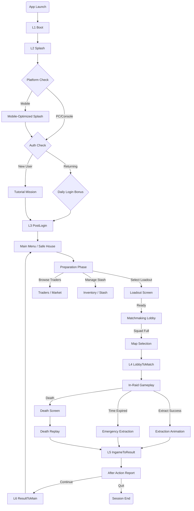

## Điều Hướng Nhanh

| điểm đến | cách dùng |
| :--- | :--- |
| [UI/UX Index](_index/index.html) | Full UI/UX documentation hub |
| [màn hình Groups Overview](screen_groups_overview/index.html) | Lifecycle taxonomy và designer-ready spec template |
| [global UX Standards](global_ux_standards/index.html) | shared navigation, focus, trạng thái, modal, và accessibility rules |
| [Out-of-Raid màn hình](out_of_raid_screens/index.html) | Home, loadout, stash, quests, profile |
| [Pre-Raid màn hình](pre_raid_screens/index.html) | Mode/map/deploy/squad/matchmaking flow |
| [Post-Raid màn hình](post_raid_screens/index.html) | kết quả, loot, replay, redeploy flow |

---

## người chơi Journey Map

### Session flow (The "Happy Path")



**loading nodes (L1–L8):** Xem [loading màn hình Design](loadingscreen_design/index.html) for full taxonomy. L7 (Map Transition) và L8 (Reconnect) apply to multi-zone raids và disconnect recovery respectively.

<!-- REF_IMAGE: người chơi session flow diagram — full-color version of the mermaid chart above với visual polish và game-cụ thể artwork -->

---

## Cross-Platform Wireframe Sets

### 1. Main Menu / Safe House (The Hub)

**mục tiêu:** Immediate "Play" CTA while showcasing progression across all platforms.

#### **Desktop/Console Layout (16:9 Landscape)**

```
+------------------------------------------------------------+
| [Profile: Lvl 12]  EXTRACTION ROYALE  [₽ 425,000] [$10]    |
|                                                            |
|              [3D OPERATOR MODEL - SPOTLIGHT]               |
|         (Character Preview with Equipped Gear)             |
|                                                            |
|                    [ ▶ START RAID ]                        |
|               (Pulsing Orange Action Button)               |
|                   [Solo | Duo | Squad ▼]                   |
|                                                            |
| +----------------+ +----------------+ +----------------+   |
| | [LOADOUT]      | | [TRADERS]      | | [HIDEOUT]      |   |
| |  Customize     | |  Buy/Sell      | |  Upgrades      |   |
| +----------------+ +----------------+ +----------------+   |
|                                                            |
| [Battle Pass Tier 12/50]      [Friends Online: 3]  []      |
+------------------------------------------------------------+
```

<!-- REF_IMAGE: Main Menu high-fidelity mockup — showing the PC/Console landscape layout với the Neo-Industrial visual style -->

**chính Differences:**
*   **Mobile:** Vertical stacking, simplified labels, larger touch targets
*   **Desktop:** Horizontal layout, more info density, mouse-over tooltips
*   **Console:** D-Pad grid navigation với rõ highlight trạng thái

---

### 2. Inventory Management ("The Tetris")

**mục tiêu:** Efficient sorting và equipping across input methods.

#### **Desktop (Mouse + Keyboard)**

```
+--------------------------------------------------------------------+
| < BACK        STASH (12x40 Grid)                   [Sort] []       |
| ------------------------------------------------------------------ |
| [GRID VIEW - DRAG & DROP]               | [EQUIPPED LOADOUT]       |
| +-----------------------------------+   | +----------------------+ |
| | [] [] [Rifle    ] [] []           |   | | PRIMARY: AK-74M      | |
| | [] [] [         ] [] []           |   | | DMG 45  RPM 650      | |
| | [] [Vest      ] [] [] []          |   | +----------------------+ |
| | [] [          ] [] [] []          |   | [HELMET] [ARMOR Lv3]     |
| | [] [] [] [] [] [] []              |   | [RIG 12] [PACK 24L]      |
| +-----------------------------------+   | [SECURE 4] Protected     |
| FILTERS: [Weapons] [Meds] [Ammo]        | Weight: 24.5 / 40kg      |
| [SELL ALL JUNK] [AUTO SORT]             | Speed: -15%              |
+--------------------------------------------------------------------+
```

<!-- REF_IMAGE: Inventory Management mockup — showing PC drag-và-drop grid view, Console cursor mode, và Mobile list view -->

#### **Console (Controller)**

```
+--------------------------------------------------------------------+
| STASH                         [LB/RB Tabs]            [Y=Sort]     |
| ------------------------------------------------------------------ |
| GRID CURSOR MODE                        | [EQUIPPED LOADOUT]       |
| +--[Selected Item]----------------+     | +----------------------+ |
| | AK-74M Rifle                    |     | | PRIMARY: Empty      |  |
| | Durability: 85%                 |     | | HELMET  ARMOR       |  |
| | Value: RUB 45,000               |     | | RIG     BACKPACK    |  |
| +---------------------------------+     | +----------------------+ |
|                                                                    |
| [A] Equip     [X] Drop     [B] Back     [Y] Quick-Sell             |
| Navigation: D-Pad grid                 Left Stick scroll           |
+--------------------------------------------------------------------+
```

#### **Mobile (Touch)**

```
+------------------------------------+
| STASH             [Sort] [Filter]  |
| ---------------------------------- |
| [SWIPE SCROLL LIST VIEW]           |
| +------------------------------+   |
| | AK-74M                Equip |    |
| | Medkit                  Use |    |
| | Battery                Drop |    |
| +------------------------------+   |
|                                    |
| [EQUIPPED]      [Weight Bar]       |
| [Rifle] [Helmet] [Armor]           |
|                                    |
| [TAP TO EQUIP]                     |
+------------------------------------+
```

**Platform Interactions:**
*   **PC:** Drag & Drop primary. Right-click context menus. Middle-click to quick-examine.
*   **Console:** Cursor-based grid navigation. Hold button to preview stats. Double-tap to equip.
*   **Mobile:** Swipe to scroll. Tap to select. Long-press for context menu. Pinch to zoom grid.

---

### 3. In-Raid HUD (Gameplay Overlay)

**mục tiêu:** Minimal obstruction, maximum information. Adapt to màn hình size & input.

#### **PC/Console (Landscape)**

```
+------------------------------------------------------------+
| [HEALTH]  [STAMINA]          EXTRACT: 15:32    [MINIMAP]   |
| [ 100] [ 85%]                               [ NE ]         |
|                                                            |
|                                                            |
|                    [GAMEPLAY AREA]                         |
|               (Minimal HUD Interference)                   |
|                                                            |
|                                                            |
| [PRIMARY ]                                         [SQUAD] |
| [AK-74 | 30/120]                               [ Player1 ] |
| [GRENADE x2]                                   [ Player2 ] |
|                                                [ Player3 ] |
+------------------------------------------------------------+

PROXIMITY INDICATORS (Dynamic):
- Red pips on compass for nearby enemies (180° FOV)
- Blue markers for squadmates (through walls)
- Yellow ! for loot containers (within 25m)
```

#### **Mobile (Portrait - Condensed)**

```
+---------------------------+
| 100 85% [⏱15:32][]        |
|                           |
|                           |
|   [GAMEPLAY]              |
|                           |
|                           |
|                           |
| [] [FIRE] [RELOAD][JUMP]  |
| [JOYSTICK] AK 30/120      |
+---------------------------+

ADAPTIVE CHANGES:
- Auto-hide UI elements after 3 seconds of inactivity
- Tap minimap to expand full-screen
- Swipe down from top to access inventory (pauses movement)
```

---

### 4. Looting Interface (In-Raid Risk/Reward)

**mục tiêu:** Speed vs. Risk. Looting partially blocks vision và movement.

#### **PC (Fast Cursor-Based)**

```
+------------------------------------------------------------+
| (75% BLURRED GAME BACKGROUND - DANGER VISIBLE)    [X]      |
|                                                            |
| CONTAINER: Dead PMC              YOUR BACKPACK             |
| +----------------------+      +------------------------+   |
| |  M4A1      [TAKE]    |  >>  |  AK-74                 |   |
| |  IFAK      [TAKE]    |      |  Medkit                |   |
| |  Key308    [TAKE]    |      | [____Empty Slot____]   |   |
| |  $15,000   [TAKE]    |      | [____Empty Slot____]   |   |
| +----------------------+      +------------------------+   |
|                                                            |
| [TAKE ALL] (Hold F - 2 sec)    Weight: 32kg / 40kg         |
|                                Movement: -25% Speed        |
+------------------------------------------------------------+
```

#### **Console (Simplified List)**

```
+------------------------------------------------------------+
| LOOTING CONTAINER                                 [B] CLOSE|
|                                                            |
| D-PAD TO SELECT:                                           |
| >  M4A1 Rifle                            [A] Take          |
|    IFAK Medkit                           [A] Take          |
|    Marked Room Key                       [A] Take          |
|    Rubles (₽15,000)                      [A] Take          |
|                                                            |
| [Y] LOOT ALL (Hold 2 sec)         Backpack: 32/40 kg       |
+------------------------------------------------------------+
```

**Tension cơ chế:**
*   **màn hình Obstruction:** 60-75% màn hình coverage (can still see threats)
*   **Movement Penalty:** Cannot sprint while looting
*   **Audio Cue:** Looting sounds attract nearby AI/người chơi
*   **Progress Bar:** "Loot All" requires 2-second commitment (animation lock)

---

### 5. Social flow (Party, LFG, Clan)

#### hệ thống Diagram

```
Home / Social Button
        |
        v
+------------------+     +------------------+     +------------------+
| Friends / Recent | --> | Party Panel      | --> | Squad Lobby      |
| invite, message  |     | ready, privacy   |     | deploy blockers  |
+------------------+     +------------------+     +------------------+
        |
        v
+------------------+     +------------------+
| LFG Board        | --> | Clan Hub         |
| join/create post |     | roster, chat     |
+------------------+     +------------------+
```

### 6. Progression / LiveOps flow

#### hệ thống Diagram

```
Home event card -> Event Hub -> Track Objective -> Raid -> AAR
       |              |              |             |
       v              v              v             v
 Battle Pass     Reward Inbox    Quest Board    Claim / Redeploy
       |
       v
Ranked Overview -> Leaderboard -> Season Summary
```

#### Progression / Reward Claim Journey

```
+--------------------------------------------------------------------------------+
| Entry: Home Badge / AAR Row / Battle Pass Tile / Event Objective / Inbox       |
|--------------------------------------------------------------------------------|
| 1. Source Context -> 2. Progress Detail -> 3. Claim / Track / Play / Upgrade    |
| 4. Capacity + Expiry Check -> 5. Reward Destination -> 6. Return / Next Goal    |
+--------------------------------------------------------------------------------+
```

| Step | Required Behavior |
| :--- | :--- |
| Source context | Preserve player đến từ AAR, Battle Pass, Event Hub, Quest Board, Ranked, News, hoặc Inbox |
| Progress detail | Show objective, XP/tier progress, free/premium status, timer, reward, và blocker |
| Action | Claim, Track, Play, View Rules, hoặc Commerce Upgrade phải rõ ràng và không lẫn nhau |
| Capacity/expiry check | Stash full, cap reached, expired, offline, premium locked, hoặc duplicate states show next action |
| Destination | Reward đi tới stash, inbox, profile, currency balance, battle pass, trader unlock, hoặc season archive |
| Return | Back quay về source screen; next goal gợi ý deploy, track, claim next, hoặc view summary |

#### Season / Event Participation Journey

```
News/Home -> Event Hub -> Rule Review -> Track Objective -> Queue/Raid
    -> AAR Progress -> Reward Claim -> Grace/Archive/Season Summary
```

| Phase | Required Behavior |
| :--- | :--- |
| Announcement | Show start/end, rules, rewards, affected maps/modes, và restrictions |
| Participation | Deep link tới exact playable route với event rules applied |
| Progress | AAR và Event Hub thống nhất objective count, reward state, và event currency |
| Ending | Promote unclaimed rewards, conversion policy, và claim grace |
| Archive | Read-only recap giữ achievements/rewards dễ hiểu sau reset |

### 7. Settings / hệ thống Error flow

#### trạng thái Diagram

```
Settings Open -> Change Option -> Apply
      |              |            |
      v              v            v
 Platform Lock   Unsaved      Success Toast
      |              |
      v              v
 Reason + Help   Revert / Confirm

System Error -> Retry available? -> Retry -> Success
      |              |
      |              no
      v              v
 Support Path    Exit / Update / Offline
```

---

## trạng thái Machine Examples

### Button trạng thái (Universal Across Platforms)

1.  **Normal:** Default color (Steel Gray #6B7280), 100% opacity
2.  **Hover (PC):** Highlight border (Tactical Blue #3B82F6), 110% scale
3.  **Selected (Console):** Gold outline (#FACC15), subtle pulse animation
4.  **Pressed:** 90% scale + haptic feedback (controller/mobile)
5.  **disabled:** 50% opacity, grayscale filter
6.  **loading:** Spinner overlay, 75% opacity

### Feedback Loop Standards

#### **Positive Actions** (success)
*   **Visual:** Green flash (#22C55E), item icon flies to inventory slot
*   **Audio:** Satisfying "click" + item-cụ thể sound (metal clank, fabric rustle)
*   **Haptic:** Single medium pulse (200ms)

#### **Negative Actions** (Error)
*   **Visual:** Red shake animation (5px amplitude, 3 cycles)
*   **Audio:** Error buzz (low pitch, 100ms)
*   **Haptic:** Double short pulse (100ms each)

#### **Process Indicators** (Ongoing)
*   **Searching Body:** Circular progress bar around cursor/crosshair (2 seconds)
*   **Healing:** Radial fill around máu bar (5-10 seconds)
*   **Reloading:** Magazine icon slide animation (vũ khí-cụ thể timing)

---

## Platform-cụ thể Navigation Patterns

### PC (Keyboard Priority)
*   **Tab:** Cycle thông qua HUD elements (Inventory → Map → Squad)
*   **ESC:** Hierarchical back (closes deepest menu first)
*   **Spacebar:** Confirm/Select (secondary to mouse click)
*   **Hold Shift:** Quick-loot mode (auto-transfers items to backpack)

### Console (D-Pad Grid)
*   **D-Pad:** Navigate UI grid (horizontal/vertical)
*   **Analog Stick:** Free cursor mode in menus (toggleable)
*   **A/X (Confirm):** Context-sensitive (Pickup/cách dùng/Open/Talk)
*   **B/Circle (Cancel):** Always goes back one menu level
*   **Shoulder Buttons (LB/RB):** Tab switching in multi-panel menus

### Mobile (Gesture-Based)
*   **Tap:** Select/Confirm
*   **Double-Tap:** Quick equip (bypass confirmation)
*   **Long-Press:** Context menu (Discard/Examine/cách dùng)
*   **Swipe Left/Right:** Navigate tabs (Stash → Traders → Safe House)
*   **Pinch:** Zoom in inventory grid (mobile-exclusive)
*   **Two-Finger Swipe Down:** Quick access to settings (global gesture)

---

## Performance Optimization for UI

### Rendering Best Practices
*   **UI Canvas Resolution:** Locked to 1080p với upscaling for 4K (reduces draw calls)
*   **Texture Atlases:** All icons in 2048x2048 sprite sheets (max 3 atlases total)
*   **Dynamic Batching:** UI elements grouped by material to minimize trạng thái changes
*   **Occlusion Culling:** Hidden menus fully disabled, not just invisible

### Platform-cụ thể FPS Targets
| Platform           | UI Target FPS |           Gameplay Target FPS           |
| :----------------- | :-----------: | :-------------------------------------: |
| PC (High-End)      |    144 FPS    |               120-144 FPS               |
| PC (Mid-Range)     |    60 FPS     |                 60 FPS                  |
| Console (Next-Gen) |    60 FPS     | 60 FPS (Performance) / 30 FPS (Quality) |
| Console (Last-Gen) |    30 FPS     |                 30 FPS                  |
| Mobile (Flagship)  |    60 FPS     |                 60 FPS                  |
| Mobile (Mid-Tier)  |    30 FPS     |                 30 FPS                  |

---

## User Testing Scenarios

### Scenario 1: First-thời gian người chơi (Tutorial)
**Task:** Complete first raid mà không opening manual.  
**success Metrics:**
*   No tutorial skips
*   <5% drop-off trước first extraction
*   Post-mission comprehension quiz >70% correct

### Scenario 2: Experienced người chơi (Speed)
**Task:** Equip loadout và enter matchmaking.  
**success Metrics:**
*   PC: <15 seconds
*   Console: <25 seconds
*   Mobile: <30 seconds

### Scenario 3: Cross-Platform Switching
**Task:** người chơi moves from PC to Mobile mid-session.  
**success Metrics:**
*   Zero confusion on control sơ đồ (auto-detect)
*   All progression synced within 5 seconds
*   No re-tutorial required

---

## Accessibility-cụ thể flow

### Colorblind Mode (Protanopia Example)
*   **Red địch Indicators → Orange/Purple**
*   **Green Friendly Markers → Blue**
*   **Yellow Loot → White với border**
*   **Rarity Colors:** cách dùng shapes + text labels, not just color

### màn hình Reader Support (Mobile Priority)
*   All buttons have accessible labels ("Equip primary vũ khí" not "Button 5")
*   Menu navigation reads hiện tại position ("Inventory, Item 3 of 15")
*   Critical alerts read aloud ("Extraction available. 2 minutes remaining.")

### Motor Impairment Assist
*   **Auto-Run Toggle:** Single tap to move (no constant pressure)
*   **Hold-to-Confirm Timeout:** Adjustable 0.5-3 seconds
*   **Aim Assist Slider:** 0%-100% magnetism strength

---

## Designer Handoff Mapping

Dùng trang này để understand journey order và transition intent. cách dùng the linked màn hình group trang for layout, component, trạng thái, và input chi tiết.

| flow | Canonical chi tiết trang | Designer Check |
| :--- | :--- | :--- |
| Boot to Home | [Settings & hệ thống màn hình](commerce_settings_system_screens/index.html), [loading màn hình Design](loadingscreen_design/index.html) | loading/account errors và setup trạng thái are explicit |
| Home to Queue | [Out-of-Raid màn hình](out_of_raid_screens/index.html), [Pre-Raid màn hình](pre_raid_screens/index.html) | deploy blockers và risk confirmation are preserved |
| Queue to Raid | [Pre-Raid màn hình](pre_raid_screens/index.html), [loading màn hình Design](loadingscreen_design/index.html) | match found, cancel lock, và L4 loading trạng thái align |
| In-Raid Action | [HUD Design](hud_design/index.html), [In-Raid màn hình](in_raid_screens/index.html), [Notification hệ thống](notification_systems/index.html) | overlays preserve combat readability và audio awareness |
| Raid to Results | [Post-Raid màn hình](post_raid_screens/index.html), [loading màn hình Design](loadingscreen_design/index.html) | outcome, loot, replay, và redeploy validation are rõ |
| Social Coordination | [Social màn hình](social_screens/index.html) | invite, voice, privacy, và safety trạng thái are respected |
| LiveOps Progression | [Progression & LiveOps màn hình](progression_liveops_screens/index.html) | rewards, expiry, premium/free, và claim blockers are hiển thị rõ |
| Commerce purchase | [Commerce màn hình](commerce_screens/index.html), [Progression & LiveOps màn hình](progression_liveops_screens/index.html) | offer, preview, giá, confirmation, receipt, và upgrade routes are explicit |
| Settings Recovery | [Settings & hệ thống màn hình](commerce_settings_system_screens/index.html), [global UX Standards](global_ux_standards/index.html) | apply/revert, locks, errors, và support routes are explicit |

### Commerce Purchase Journey

```
Entry
  Home Shop tab / Battle Pass Upgrade / Event Store / Insufficient Balance / Redeem Link
    -> Offer Card or Deep Link Target
    -> Offer Detail / Bundle Detail / Item Preview
    -> Optional Currency Top-Up
    -> Purchase Confirmation
    -> Platform Checkout Handoff when required
    -> Purchase Result / Receipt
    -> Equip / View Owned / Back to Shop / Purchase Help
```

| Step | Required Trust State |
| :--- | :--- |
| Entry | Source context preserved để Back quay về Home, Battle Pass, Event, hoặc blocked offer |
| Offer | Price, ownership, timer, restriction, và non-power context visible |
| Preview | Compatibility và variant limits visible trước purchase |
| Top-up | Localized provider price và platform handoff shown trước khi rời game UI |
| Confirmation | Final price, balance impact, contents, refund/platform note, và hold-to-confirm khi required |
| Provider handoff | Pending/cancelled/failed/succeeded states quay về receipt/result surface |
| Receipt | Granted items, provider/reference id, support route, và duplicate-charge-safe copy visible |

### flow QA checklist

- [ ] Each journey transition has a rõ source màn hình, điểm đến màn hình, và failure trạng thái.
- [ ] Any flow that risks gear, currency, account access, privacy, hoặc người chơi safety includes confirmation/consequence copy.
- [ ] Mobile flow variants preserve primary CTA reachability và do not rely on desktop hover.
- [ ] flow diagrams do not contradict màn hình-level CTAs hoặc disabled-trạng thái rules.
