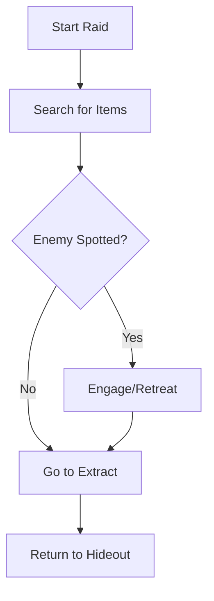

# Hextra Documentation Guide

This guide describes how to use the advanced features of the Hextra theme to enhance the **Extraction Project GDD**.

## Callouts

Use callouts to highlight important information, designer notes, or technical warnings.

```markdown

**Designer Note:** The recoil pattern should feel heavy but predictable.



**Technical Warning:** Reducing the tick rate below 30Hz will cause noticeable desync in physics.



**Critical:** Anti-cheat must be initialized before any gameplay logic starts.

```

## Mermaid Diagrams

You can embed diagrams directly in Markdown. Perfect for logic flows and state machines. Hextra renders these automatically from code blocks with the `mermaid` language.

```markdown

```

## Tabs

Use tabs to compare different versions, platform settings, or weapon classes.

```markdown

  **M4A1**: High fire rate, low damage per hit.
  **AK-74**: Medium fire rate, high penetration.
  **MP5**: Very high fire rate, low penetration, close range.

```

## File Tree

Use the file tree to explain the project structure of the Unreal Engine project.

```markdown

  
    
      
      
    
    
      
    
  

```

## Steps

Great for tutorial walkthroughs or installation steps.

```markdown


### Step 1: Initialize Project
Clone the repository and run `git submodule update`.

### Step 2: Build Assets
Run the build script to compile shaders.

### Step 3: Launch
Open the project in Unreal Editor 5.x.


```

## Cards

Useful for landing pages or linking to major sections.

```markdown

  
  

```
