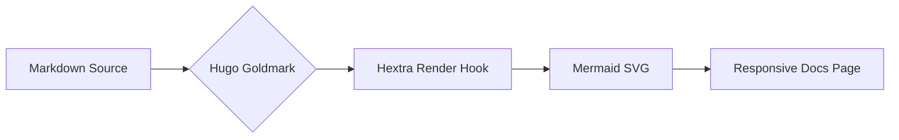
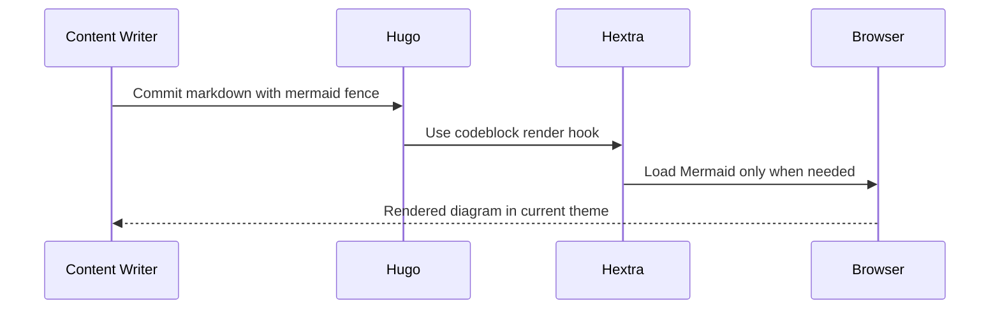
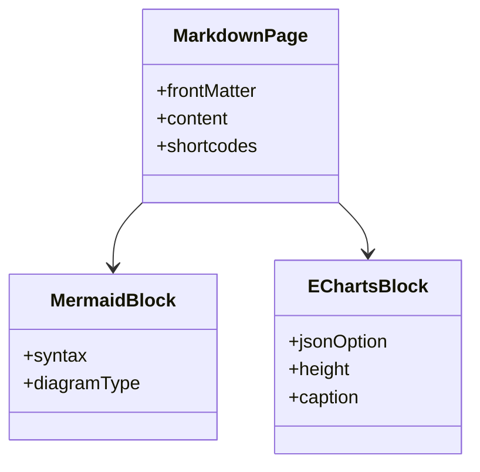
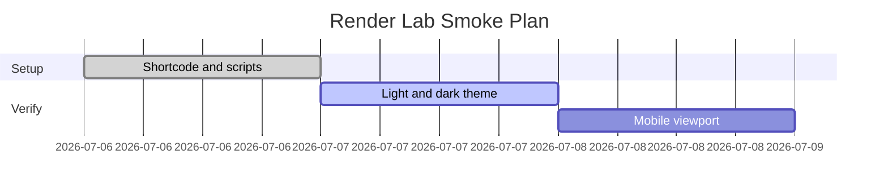
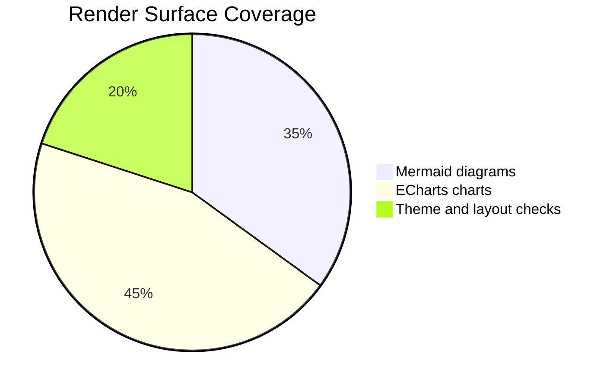
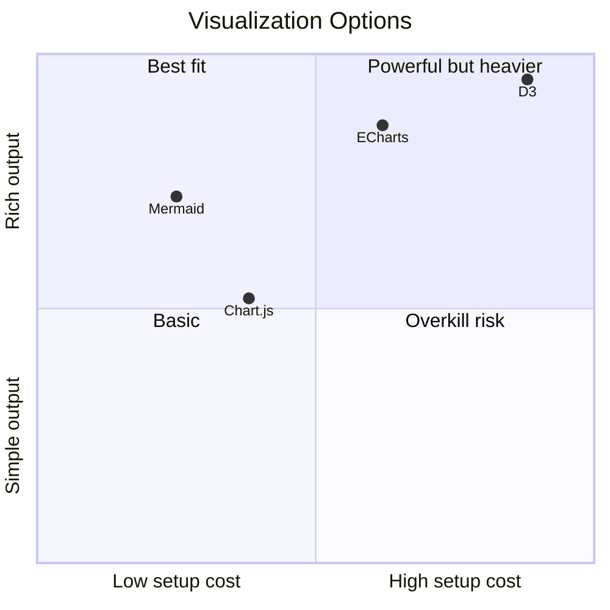

# Render Lab

Trang này dùng để kiểm thử render Markdown nâng cao trong Hugo/Hextra: Mermaid diagrams, Apache ECharts rich charts, theme light/dark, nhãn dài, tiếng Việt và layout responsive.

## Mermaid

### Flowchart

### Sequence

### Class Diagram

### Gantt

### Pie

### Quadrant

## Apache ECharts

### Bar Chart With Vietnamese Labels


{
  "title": {
    "text": "Mức độ sẵn sàng tài liệu"
  },
  "tooltip": {
    "trigger": "axis"
  },
  "grid": {
    "left": 56,
    "right": 24,
    "top": 72,
    "bottom": 88
  },
  "xAxis": {
    "type": "category",
    "axisLabel": {
      "interval": 0,
      "rotate": 20
    },
    "data": [
      "Design Overview",
      "Gameplay Systems",
      "Technical Architecture",
      "UI/UX Vietnamese Long Label",
      "Agent Workflows"
    ]
  },
  "yAxis": {
    "type": "value",
    "max": 100
  },
  "series": [
    {
      "name": "Coverage",
      "type": "bar",
      "data": [82, 76, 68, 91, 73],
      "itemStyle": {
        "color": "#2563eb"
      }
    }
  ]
}


### Multi-Series Line Chart


{
  "title": {
    "text": "Render Stability Trend"
  },
  "tooltip": {
    "trigger": "axis"
  },
  "legend": {
    "top": 32,
    "data": ["Mermaid", "ECharts", "Markdown Tables"]
  },
  "grid": {
    "left": 48,
    "right": 24,
    "top": 84,
    "bottom": 48
  },
  "xAxis": {
    "type": "category",
    "boundaryGap": false,
    "data": ["Mon", "Tue", "Wed", "Thu", "Fri", "Sat", "Sun"]
  },
  "yAxis": {
    "type": "value"
  },
  "series": [
    {
      "name": "Mermaid",
      "type": "line",
      "smooth": true,
      "data": [88, 90, 91, 92, 94, 93, 95]
    },
    {
      "name": "ECharts",
      "type": "line",
      "smooth": true,
      "data": [72, 78, 83, 86, 89, 91, 93]
    },
    {
      "name": "Markdown Tables",
      "type": "line",
      "smooth": true,
      "data": [95, 95, 96, 96, 97, 97, 98]
    }
  ]
}


### Donut Chart


{
  "title": {
    "text": "Visualization Mix",
    "left": "center"
  },
  "tooltip": {
    "trigger": "item"
  },
  "legend": {
    "bottom": 0
  },
  "series": [
    {
      "name": "Render Type",
      "type": "pie",
      "radius": ["42%", "68%"],
      "avoidLabelOverlap": true,
      "data": [
        { "value": 32, "name": "Flow diagrams" },
        { "value": 28, "name": "Charts" },
        { "value": 18, "name": "Graphs" },
        { "value": 22, "name": "Tables and prose" }
      ]
    }
  ]
}


### Scatter Chart


{
  "title": {
    "text": "Complexity vs. Documentation Value"
  },
  "tooltip": {
    "trigger": "item"
  },
  "grid": {
    "left": 48,
    "right": 24,
    "top": 72,
    "bottom": 48
  },
  "xAxis": {
    "type": "value",
    "name": "Setup cost"
  },
  "yAxis": {
    "type": "value",
    "name": "Value"
  },
  "series": [
    {
      "name": "Options",
      "type": "scatter",
      "symbolSize": 18,
      "data": [
        [2, 7, "Mermaid"],
        [4, 8, "ECharts"],
        [3, 5, "Chart.js"],
        [8, 9, "D3"],
        [6, 8, "Vega-Lite"]
      ]
    }
  ]
}


### Graph Network


{
  "title": {
    "text": "Markdown Rendering Pipeline"
  },
  "tooltip": {},
  "series": [
    {
      "type": "graph",
      "layout": "force",
      "roam": true,
      "label": {
        "show": true
      },
      "force": {
        "repulsion": 260,
        "edgeLength": 120
      },
      "data": [
        { "name": "Markdown", "symbolSize": 56 },
        { "name": "Hugo", "symbolSize": 52 },
        { "name": "Hextra", "symbolSize": 52 },
        { "name": "Mermaid", "symbolSize": 44 },
        { "name": "ECharts", "symbolSize": 44 },
        { "name": "Browser", "symbolSize": 50 },
        { "name": "Light/Dark Theme", "symbolSize": 46 }
      ],
      "links": [
        { "source": "Markdown", "target": "Hugo" },
        { "source": "Hugo", "target": "Hextra" },
        { "source": "Hextra", "target": "Mermaid" },
        { "source": "Hextra", "target": "ECharts" },
        { "source": "Mermaid", "target": "Browser" },
        { "source": "ECharts", "target": "Browser" },
        { "source": "Light/Dark Theme", "target": "Mermaid" },
        { "source": "Light/Dark Theme", "target": "ECharts" }
      ],
      "lineStyle": {
        "curveness": 0.18
      }
    }
  ]
}


### Tree


{
  "tooltip": {
    "trigger": "item",
    "triggerOn": "mousemove"
  },
  "series": [
    {
      "type": "tree",
      "top": "8%",
      "left": "8%",
      "bottom": "8%",
      "right": "20%",
      "symbolSize": 10,
      "label": {
        "position": "left",
        "verticalAlign": "middle",
        "align": "right"
      },
      "leaves": {
        "label": {
          "position": "right",
          "verticalAlign": "middle",
          "align": "left"
        }
      },
      "expandAndCollapse": true,
      "animationDuration": 450,
      "data": [
        {
          "name": "Render Lab",
          "children": [
            {
              "name": "Mermaid",
              "children": [
                { "name": "Flowchart" },
                { "name": "Sequence" },
                { "name": "Gantt" }
              ]
            },
            {
              "name": "ECharts",
              "children": [
                { "name": "Bar and Line" },
                { "name": "Graph Network" },
                { "name": "Tree with Vietnamese-ready labels" }
              ]
            }
          ]
        }
      ]
    }
  ]
}


## Framework Support Notes

| Framework | Current repo support | Best use |
| --- | --- | --- |
| Mermaid | Supported by Hextra code fence | Diagrams stored as text in Markdown |
| Apache ECharts | Added by this render lab shortcode | Rich charts, dashboards, graph/network visualizations |
| Chart.js | Not integrated | Simple canvas charts |
| Vega-Lite | Not integrated | Declarative data-analysis charts |
| D3 | Not integrated | Custom visualizations with maximum control |
| Observable Plot | Not integrated | Concise exploratory charts |
